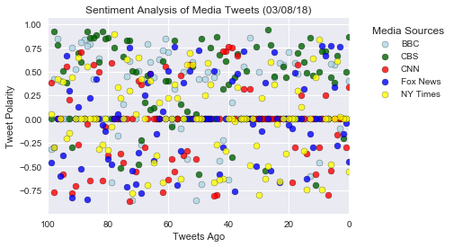
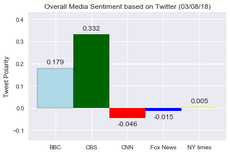

```python
# Steven Pham
# Hw # 7  - Distinguishing Sentiments
```

# Twitter Analysis on Media Sources (Last 100 Tweets)

- It can be inferred that a majority of tweets from each station are neutral. There is a large number of tweets on the scatterplot that follows the center point (at 0).


- Despite some neutrality among stations - CBS seems to have more positive tweets than any other stations. The bar plot for CBS tops the highest at 0.332, followed by BBC at 0.179.


- Besides the neutrality among stations on the scatterplot, there is no clear or discernible patter for the last 100 tweets from each station. 


- Limitations to note: 
    - This analysis is only applicable to this point in time - as any "big" news can quickly swing the values in the plot around. 
    - VADER analysis is limited - it does not deal well with ambiguous or sarcastic text. 
    - There is also quite a few of texts that has unique emoticons (which pandas/VADER cannot properly read here), which could heavily influence how the text could be interpreted


```python
# Dependencies
import pandas as pd
import tweepy
import json
import numpy as np
import matplotlib.pyplot as plt
import seaborn as sns
import time
import datetime 
import yaml

# YAML set up to protect twitter keys
with open("./config.yaml") as y:
    config = yaml.load(y)

# Import and Initialize Sentiment Analyzer
from vaderSentiment.vaderSentiment import SentimentIntensityAnalyzer
analyzer = SentimentIntensityAnalyzer()

# Twitter API Keys
consumer_key = "FTnlycXaskt97cX1lILL5hvEU"
access_token = "15177438-4vwpB12VWYxuoKmAxDSBUafv2n3QrbejrwA5q0qBa"

# Loading YAML settings for Secret
consumer_secret = config['consec']
access_token_secret = config['accsec']

# Setup Tweepy API Authentication
auth = tweepy.OAuthHandler(consumer_key, consumer_secret)
auth.set_access_token(access_token, access_token_secret)
api = tweepy.API(auth, parser=tweepy.parsers.JSONParser())
```


```python
# Target Search Term
news_station_list = ("@BBC", "@CBS", "@CNN", "@FoxNews", "@nytimes")
news_station_compound = []
counter = 0
```


```python
for news_station in news_station_list:

    news_tweets = api.user_timeline(news_station, count=100, result_type="recent")


    print("========================")
    print("Results for: " +str(news_station))
    print("========================")

    for tweets in news_tweets:

        compound = analyzer.polarity_scores(tweets["text"])["compound"]
        pos = analyzer.polarity_scores(tweets["text"])["pos"]
        neu = analyzer.polarity_scores(tweets["text"])["neu"]
        neg = analyzer.polarity_scores(tweets["text"])["neg"]

        print(news_station + " | Time: " + tweets["created_at"])
        print("# " +str(counter) +" Tweet: " + tweets["text"])
        print("Compound: " +str(compound) + " | Pos: " +str(pos) +" | Neu: " +str(neu) +" | Neg: " +str(neg) +"\n")

        news_station_compound.append({"News Org": news_station, "Created": tweets["created_at"],
                                      "Compound": compound, "#": counter,
                                     "Positive": pos, "Negative": neg, "Neutral": neu,  "Tweet": tweets["text"]})
        
        counter = counter + 1

    print("========================")
    print("End Results for " +str(news_station))
    print("======================== \n")
    
    counter = 0
```

    ========================
    Results for: @BBC
    ========================
    @BBC | Time: Thu Mar 08 20:33:04 +0000 2018
    # 0 Tweet: Jack Jarvis and Victor McDade are back for another hilarious six-part series. 
    
    #StillGame | 9:30pm | @BBCOne |… https://t.co/zFtd4VQyKL
    Compound: 0.4019 | Pos: 0.144 | Neu: 0.856 | Neg: 0.0
    
    @BBC | Time: Thu Mar 08 20:03:04 +0000 2018
    # 1 Tweet: Lucy and Lee are back! 🙌🎉
    
    #NotGoingOut | 9pm | @BBCOne | https://t.co/dUnnFaIoci https://t.co/gSpTMCPrSC
    Compound: 0.0 | Pos: 0.0 | Neu: 1.0 | Neg: 0.0
    
    @BBC | Time: Thu Mar 08 18:00:06 +0000 2018
    # 2 Tweet: What advice would YOU give your younger self? 🤔
    
    #InternationalWomensDay #IWD2018 https://t.co/vIwPLtzTbO
    Compound: 0.0 | Pos: 0.0 | Neu: 1.0 | Neg: 0.0
    
    @BBC | Time: Thu Mar 08 17:30:11 +0000 2018
    # 3 Tweet: In recognition of International Women’s Day, a playlist in celebration of the funniest, saddest and most significan… https://t.co/4WCrxvJxFY
    Compound: -0.1027 | Pos: 0.159 | Neu: 0.664 | Neg: 0.177
    
    @BBC | Time: Thu Mar 08 17:00:09 +0000 2018
    # 4 Tweet: 🔬 More than half of the UK can't name a famous woman in science. 
    
    Time to change that. 
    👉 https://t.co/3HVhvFaxaT… https://t.co/KL0D1vIw8S
    Compound: 0.0 | Pos: 0.0 | Neu: 1.0 | Neg: 0.0
    
    @BBC | Time: Thu Mar 08 16:30:05 +0000 2018
    # 5 Tweet: ✍️🙌 Lotte Reiniger is the unsung heroine of early animation. 
    
    #InternationalWomensDay #IWD2018 https://t.co/Z4qDFWXcCS
    Compound: 0.5719 | Pos: 0.236 | Neu: 0.764 | Neg: 0.0
    
    @BBC | Time: Thu Mar 08 16:05:42 +0000 2018
    # 6 Tweet: RT @BBCMOTD: Favourite emoji?
    Champions League or World Cup?
    
    @TekkerzKid quizzes @ManUtd striker @MarcusRashford for #BBCOwnIt.
    
    📺 Check o…
    Compound: 0.5803 | Pos: 0.181 | Neu: 0.819 | Neg: 0.0
    
    @BBC | Time: Thu Mar 08 15:30:09 +0000 2018
    # 7 Tweet: ⚽️🥅 The story of the fall and rise of women's football, told through 10 objects collected by the National… https://t.co/xOi8wNW64N
    Compound: 0.0 | Pos: 0.0 | Neu: 1.0 | Neg: 0.0
    
    @BBC | Time: Thu Mar 08 15:09:13 +0000 2018
    # 8 Tweet: RT @bbcmusic: 🙌 @Camila_Cabello just dropped the video for 'Never Be The Same' 💕
    What do you think?
    
    Watch 👉 https://t.co/gv60m6x9Wk https:…
    Compound: 0.0 | Pos: 0.0 | Neu: 1.0 | Neg: 0.0
    
    @BBC | Time: Thu Mar 08 15:00:05 +0000 2018
    # 9 Tweet: Nine-year-old Lola thinks more girls should take up skateboarding.
    
    Lola is rad. 🤘😝
    
    #InternationalWomensDay… https://t.co/EeOygOVfoh
    Compound: 0.0 | Pos: 0.0 | Neu: 1.0 | Neg: 0.0
    
    @BBC | Time: Thu Mar 08 14:30:02 +0000 2018
    # 10 Tweet: 🎨🖼 #AnnieSwynnerton: The woman who forced open the male art world and blazed a trail for female artists.
    👉… https://t.co/rHDoqWL4iI
    Compound: -0.4588 | Pos: 0.0 | Neu: 0.857 | Neg: 0.143
    
    @BBC | Time: Thu Mar 08 13:30:05 +0000 2018
    # 11 Tweet: 🎓🎒 These women are pushing young girls into school, not marriage. 
    
    #InternationalWomensDay #IWD2018 https://t.co/TIf5lbu3GZ
    Compound: 0.0 | Pos: 0.0 | Neu: 1.0 | Neg: 0.0
    
    @BBC | Time: Thu Mar 08 13:09:22 +0000 2018
    # 12 Tweet: RT @bbcworldservice: In Senegal, graffiti artist Zeinixx is campaigning for women's rights... with spray paint. 🇸🇳 https://t.co/cy2ddCmEKo
    Compound: 0.0 | Pos: 0.0 | Neu: 1.0 | Neg: 0.0
    
    @BBC | Time: Thu Mar 08 13:02:03 +0000 2018
    # 13 Tweet: RT @bbc5live: “That was the end of my childhood”
    
    Money saving expert @MartinSLewis opens up to @tonylivesey about the death of his mum, th…
    Compound: -0.5994 | Pos: 0.0 | Neu: 0.855 | Neg: 0.145
    
    @BBC | Time: Thu Mar 08 13:00:08 +0000 2018
    # 14 Tweet: 🎤 🎧Grime through time: A brief history of one of the biggest music genres to come out of the UK https://t.co/876CsOCFsa
    Compound: 0.0 | Pos: 0.0 | Neu: 1.0 | Neg: 0.0
    
    @BBC | Time: Thu Mar 08 12:34:42 +0000 2018
    # 15 Tweet: RT @BBCRadio4: Ten female authors who changed sci-fi: https://t.co/r5s1mqYrQD
    #IWD2018 https://t.co/cQxHsT9c3E
    Compound: 0.0 | Pos: 0.0 | Neu: 1.0 | Neg: 0.0
    
    @BBC | Time: Thu Mar 08 12:30:04 +0000 2018
    # 16 Tweet: Thousands of women in the UK can't afford to buy tampons and towels. 
    
    #InternationalWomensDay #IWD2018 https://t.co/66P7IrZ9lB
    Compound: 0.0 | Pos: 0.0 | Neu: 1.0 | Neg: 0.0
    
    @BBC | Time: Thu Mar 08 12:00:02 +0000 2018
    # 17 Tweet: 👷👷‍♀️ Building future engineers - it's a lot easier than you think! 
    
    #BitzAndBob | @CbeebiesHQ https://t.co/YV3kTIj0Dx
    Compound: 0.4753 | Pos: 0.205 | Neu: 0.795 | Neg: 0.0
    
    @BBC | Time: Thu Mar 08 11:46:51 +0000 2018
    # 18 Tweet: RT @BBCR1: 💛💛💛 
    
    Who's ready for @thegreatkhalid in the Live Lounge?
    
    Make sure you're listening to @claraamfo at 12pm 👉 https://t.co/48Ruy…
    Compound: 0.5859 | Pos: 0.211 | Neu: 0.789 | Neg: 0.0
    
    @BBC | Time: Thu Mar 08 11:00:05 +0000 2018
    # 19 Tweet: Life advice from one of our all-time favourite women, @DawnFrenchUK.  
    
    #InternationalWomensDay #IWD2018 https://t.co/MAOUgpWb7J
    Compound: 0.0 | Pos: 0.0 | Neu: 1.0 | Neg: 0.0
    
    @BBC | Time: Thu Mar 08 10:54:28 +0000 2018
    # 20 Tweet: RT @bbcthree: Happy International Women’s Day! Here's @StaceyDooley with some top tips for aspiring broadcasters #IWD2018 https://t.co/Rbq7…
    Compound: 0.6996 | Pos: 0.279 | Neu: 0.721 | Neg: 0.0
    
    @BBC | Time: Thu Mar 08 10:32:59 +0000 2018
    # 21 Tweet: RT @bbcarts: Clay artist @_PhoebeCummings launches her new incredible new work on #InternationalWomensDay. Audiences can watch as the sculp…
    Compound: 0.0 | Pos: 0.0 | Neu: 1.0 | Neg: 0.0
    
    @BBC | Time: Thu Mar 08 09:57:10 +0000 2018
    # 22 Tweet: RT @BBCRadio4: Who are the women that inspire you the most?
    From Dawn_French to @Leomie_Anderson, @ScarlettMoffatt to @saoirse_ronan, women…
    Compound: 0.5719 | Pos: 0.171 | Neu: 0.829 | Neg: 0.0
    
    @BBC | Time: Thu Mar 08 09:30:12 +0000 2018
    # 23 Tweet: 👔 The story behind Oscar winner James Ivory’s Timothee Chalamet shirt: https://t.co/CY4AJusVEg https://t.co/ANiWIYVSsu
    Compound: 0.5859 | Pos: 0.257 | Neu: 0.743 | Neg: 0.0
    
    @BBC | Time: Thu Mar 08 09:04:01 +0000 2018
    # 24 Tweet: 🔧 Who built the world? Girls! 
    
    #InternationalWomensDay #IWD2018 https://t.co/6QY6CDcp1h
    Compound: 0.0 | Pos: 0.0 | Neu: 1.0 | Neg: 0.0
    
    @BBC | Time: Thu Mar 08 08:30:00 +0000 2018
    # 25 Tweet: 🎧 @BBCR1's @ClaraAmfo gives aspiring DJs advice and tells us about who inspires her this #InternationalWomensDay.… https://t.co/FvBtbQ9cs1
    Compound: 0.4404 | Pos: 0.162 | Neu: 0.838 | Neg: 0.0
    
    @BBC | Time: Thu Mar 08 08:00:05 +0000 2018
    # 26 Tweet: 💪 A brief history of #feminism. 
    
    #InternationalWomensDay #IWD2018 https://t.co/EGm8W4OKJ2
    Compound: 0.0 | Pos: 0.0 | Neu: 1.0 | Neg: 0.0
    
    @BBC | Time: Thu Mar 08 07:30:06 +0000 2018
    # 27 Tweet: For more than a century people around the world have been marking #InternationalWomensDay. Here's why.
    👉… https://t.co/rkKYo23Qfo
    Compound: 0.0 | Pos: 0.0 | Neu: 1.0 | Neg: 0.0
    
    @BBC | Time: Wed Mar 07 19:12:02 +0000 2018
    # 28 Tweet: 'Harry was looking at his family for the first time in his life'. 
    
    💛⚡️✨ David Thewlis reading #HarryPotter is trul… https://t.co/wAyCDFvrX2
    Compound: 0.0 | Pos: 0.0 | Neu: 1.0 | Neg: 0.0
    
    @BBC | Time: Wed Mar 07 18:23:04 +0000 2018
    # 29 Tweet: ✂️ ‘My hair is a symbol of pride.’
    
    💇🏽💇🏿💇🏾 Six stories about black women's hair.
    👉 https://t.co/NfNvGpKpVi https://t.co/V1qrRJzwfu
    Compound: 0.0 | Pos: 0.0 | Neu: 1.0 | Neg: 0.0
    
    @BBC | Time: Wed Mar 07 17:42:01 +0000 2018
    # 30 Tweet: The little mouse that inspired Pikachu is actually a rabbit! https://t.co/AxOQOaK4dS
    Compound: 0.4987 | Pos: 0.264 | Neu: 0.736 | Neg: 0.0
    
    @BBC | Time: Wed Mar 07 17:27:29 +0000 2018
    # 31 Tweet: RT @BBCTwo: If you haven't seen #ACSVersace yet, Penélope Cruz as Donatella Versace is everything... https://t.co/lH9kfRGqO2
    Compound: 0.0 | Pos: 0.0 | Neu: 1.0 | Neg: 0.0
    
    @BBC | Time: Wed Mar 07 17:22:51 +0000 2018
    # 32 Tweet: RT @BBCBreakfast: In many ways Hedy Lamarr was the archetypal Hollywood starlet, but the Austrian born actress was also an inventor and the…
    Compound: 0.0 | Pos: 0.0 | Neu: 1.0 | Neg: 0.0
    
    @BBC | Time: Wed Mar 07 17:22:23 +0000 2018
    # 33 Tweet: RT @BBCScotlandNews: A Scottish school has won a prestigious award for its pioneering work helping children with their reading and writing…
    Compound: 0.8555 | Pos: 0.37 | Neu: 0.63 | Neg: 0.0
    
    @BBC | Time: Wed Mar 07 17:16:45 +0000 2018
    # 34 Tweet: RT @bbceurovision: A storm is coming.@surieofficial  ⛈ 👉 https://t.co/LYIiBgcZdA https://t.co/heOKLnjo2N
    Compound: 0.0 | Pos: 0.0 | Neu: 1.0 | Neg: 0.0
    
    @BBC | Time: Wed Mar 07 17:14:49 +0000 2018
    # 35 Tweet: RT @BBCTwo: Nostalgia heaven! How many of these 80s &amp; 90s things can you remember? 🤔 #BackInTimeForTea https://t.co/l0R6nHrTj1
    Compound: 0.5562 | Pos: 0.183 | Neu: 0.817 | Neg: 0.0
    
    @BBC | Time: Wed Mar 07 17:13:49 +0000 2018
    # 36 Tweet: 📖 Time to 'embiggen' your vocabulary.
    
    A new word, first heard on @TheSimpsons in 1996, has been added to the… https://t.co/qGvkGgjAcB
    Compound: 0.0 | Pos: 0.0 | Neu: 1.0 | Neg: 0.0
    
    @BBC | Time: Wed Mar 07 16:15:06 +0000 2018
    # 37 Tweet: RT @bbccomedy: WOOF! ❤️#RikMayallDay https://t.co/ioJtvYVFRO
    Compound: 0.0 | Pos: 0.0 | Neu: 1.0 | Neg: 0.0
    
    @BBC | Time: Wed Mar 07 14:30:03 +0000 2018
    # 38 Tweet: 😱 The most hardcore baptism you’ll ever see. https://t.co/aEsVqMUPQ2
    Compound: 0.0 | Pos: 0.0 | Neu: 1.0 | Neg: 0.0
    
    @BBC | Time: Wed Mar 07 13:24:05 +0000 2018
    # 39 Tweet: #InternationalWomensDay is tomorrow, so there's no better time to test how much you know about female suffrage.
    👉… https://t.co/6ulqfr8zyL
    Compound: 0.1742 | Pos: 0.14 | Neu: 0.751 | Neg: 0.109
    
    @BBC | Time: Wed Mar 07 12:30:04 +0000 2018
    # 40 Tweet: 🚂💀 All aboard London's Victorian railway for the dead. https://t.co/L7vJO4ybeD
    Compound: -0.6369 | Pos: 0.082 | Neu: 0.597 | Neg: 0.321
    
    @BBC | Time: Wed Mar 07 11:42:44 +0000 2018
    # 41 Tweet: 😍 The first polar bear cub to be born in the UK for 25 years has emerged at the @RZSS's @HighlandWPark!
    👉… https://t.co/4fhzBaxwjF
    Compound: 0.0 | Pos: 0.0 | Neu: 1.0 | Neg: 0.0
    
    @BBC | Time: Wed Mar 07 11:07:18 +0000 2018
    # 42 Tweet: RT @bbccomedy: Today would have been the 60th birthday of the legend, the genius, the king Rik Mayall. We miss you, sir! #RikMayallDay http…
    Compound: -0.2244 | Pos: 0.0 | Neu: 0.924 | Neg: 0.076
    
    @BBC | Time: Wed Mar 07 10:46:56 +0000 2018
    # 43 Tweet: The wreck of a US aircraft carrier that was sunk during WW2 has been found off the coast of Australia. https://t.co/8NQfRdFXTE
    Compound: -0.4404 | Pos: 0.0 | Neu: 0.868 | Neg: 0.132
    
    @BBC | Time: Wed Mar 07 10:41:15 +0000 2018
    # 44 Tweet: RT @BBCFOUR: There's a very good reason this extreme firework was banned... https://t.co/pdfpcDiJ4h
    Compound: 0.4927 | Pos: 0.225 | Neu: 0.775 | Neg: 0.0
    
    @BBC | Time: Wed Mar 07 09:58:38 +0000 2018
    # 45 Tweet: RT @CBeebiesHQ: 3 out of 4 parents wouldn’t be able to save their baby from choking. 
    
    Learn how to help in a first aid emergency…https://t…
    Compound: 0.4404 | Pos: 0.211 | Neu: 0.681 | Neg: 0.108
    
    @BBC | Time: Wed Mar 07 09:00:07 +0000 2018
    # 46 Tweet: A moving story of how one woman transformed Alzheimer’s research forever. ❤️https://t.co/2fwJDbWT8x
    Compound: 0.0 | Pos: 0.0 | Neu: 1.0 | Neg: 0.0
    
    @BBC | Time: Wed Mar 07 08:46:22 +0000 2018
    # 47 Tweet: RT @BBCOne: They've smashed the record for the highest profit EVER on Antiques Road Trip! 😲 https://t.co/TNuRcp2EOq
    Compound: 0.4926 | Pos: 0.175 | Neu: 0.825 | Neg: 0.0
    
    @BBC | Time: Wed Mar 07 08:46:14 +0000 2018
    # 48 Tweet: RT @bbc5live: What happens to your old paint?
    
    A scheme in Leeds to recycle unused paint has saved hundreds of tons of leftovers from endin…
    Compound: 0.4215 | Pos: 0.109 | Neu: 0.891 | Neg: 0.0
    
    @BBC | Time: Wed Mar 07 08:45:50 +0000 2018
    # 49 Tweet: RT @BBCTwo: When this father and daughter paddled into the sea, they had no idea how much danger they were in... #SavingLivesAtSea https://…
    Compound: -0.6808 | Pos: 0.0 | Neu: 0.789 | Neg: 0.211
    
    @BBC | Time: Wed Mar 07 08:44:59 +0000 2018
    # 50 Tweet: RT @cbbc: There are over 128,000 children in the UK without a home.
    
    Watch CBBC's powerful documentary about homeless children on @BBCiPlay…
    Compound: 0.4215 | Pos: 0.123 | Neu: 0.877 | Neg: 0.0
    
    @BBC | Time: Wed Mar 07 08:30:07 +0000 2018
    # 51 Tweet: Dirty water kills millions every year. 
    
    But one ingenious invention can remove dangerous microbes as they flow tow… https://t.co/isjxUnr3Dp
    Compound: -0.8591 | Pos: 0.0 | Neu: 0.627 | Neg: 0.373
    
    @BBC | Time: Wed Mar 07 08:00:04 +0000 2018
    # 52 Tweet: La Dame de Brassempouy is a beautiful 25,000 year-old representation of a female face. 
    #Civilisations https://t.co/aKGUlvJFGF
    Compound: 0.5994 | Pos: 0.231 | Neu: 0.769 | Neg: 0.0
    
    @BBC | Time: Tue Mar 06 19:30:06 +0000 2018
    # 53 Tweet: 😂🙊 Who has a filthier mouth, Jennifer Lawrence or James McAvoy? https://t.co/lOfGcHVo6R
    Compound: 0.0 | Pos: 0.0 | Neu: 1.0 | Neg: 0.0
    
    @BBC | Time: Tue Mar 06 18:30:07 +0000 2018
    # 54 Tweet: A diver swims through a thick soup of plastic waste near Bali.
    https://t.co/W8GJNKq8rm
    Compound: -0.4215 | Pos: 0.0 | Neu: 0.781 | Neg: 0.219
    
    @BBC | Time: Tue Mar 06 18:03:04 +0000 2018
    # 55 Tweet: Every day around the UK, an army of unpaid volunteers put their lives on the line to try and save complete stranger… https://t.co/W3Fel1iPSK
    Compound: 0.4939 | Pos: 0.127 | Neu: 0.873 | Neg: 0.0
    
    @BBC | Time: Tue Mar 06 17:30:07 +0000 2018
    # 56 Tweet: Impressive and terrifying in equal measure. 
    
    This woman doesn't just sleepwalk... she sleep-drives too. https://t.co/Ovwb4dNaYJ
    Compound: -0.1027 | Pos: 0.165 | Neu: 0.65 | Neg: 0.185
    
    @BBC | Time: Tue Mar 06 17:25:44 +0000 2018
    # 57 Tweet: RT @bbcwritersroom: New #Brexit #comedy Soft Border Patrol is set on the border between #NorthernIreland and the Republic of #Ireland. We p…
    Compound: 0.0 | Pos: 0.0 | Neu: 1.0 | Neg: 0.0
    
    @BBC | Time: Tue Mar 06 17:02:04 +0000 2018
    # 58 Tweet: 🐧 Scientists have stumbled across a huge group of previously unknown Adélie penguins on the most northerly point of… https://t.co/3GQ8PlQyMY
    Compound: 0.3182 | Pos: 0.119 | Neu: 0.881 | Neg: 0.0
    
    @BBC | Time: Tue Mar 06 15:30:10 +0000 2018
    # 59 Tweet: Too many Lego bricks is a problem many parents will sympathise with, but now the toy firm itself has admitted it ha… https://t.co/4J0whItWAN
    Compound: -0.0644 | Pos: 0.068 | Neu: 0.853 | Neg: 0.079
    
    @BBC | Time: Tue Mar 06 14:44:33 +0000 2018
    # 60 Tweet: RT @bbccomedy: Nothing says welcome to the neighbourhood quite like everyone's favourite busybody 😂#TwoDoorsDown https://t.co/dClRm13dm9
    Compound: 0.6997 | Pos: 0.308 | Neu: 0.692 | Neg: 0.0
    
    @BBC | Time: Tue Mar 06 14:30:05 +0000 2018
    # 61 Tweet: 🍻 Cheers to that! 
    
    Pubs will be allowed to stay open later than usual to give everyone a chance to celebrate Princ… https://t.co/K7toUnOwSG
    Compound: 0.8439 | Pos: 0.336 | Neu: 0.664 | Neg: 0.0
    
    @BBC | Time: Tue Mar 06 13:48:06 +0000 2018
    # 62 Tweet: Tickets, food wrappers and posters provide a fascinating insight into the creativity of North Korea, and the image… https://t.co/oe4tZwlBJw
    Compound: 0.7269 | Pos: 0.276 | Neu: 0.724 | Neg: 0.0
    
    @BBC | Time: Tue Mar 06 13:12:33 +0000 2018
    # 63 Tweet: RT @bbcthree: No you can't cure depression with meditation, kale or by simply cheering up. https://t.co/gsM8lRX6N2
    Compound: 0.6246 | Pos: 0.293 | Neu: 0.605 | Neg: 0.102
    
    @BBC | Time: Tue Mar 06 13:11:26 +0000 2018
    # 64 Tweet: RT @BBCScotlandNews: A giant three-dimensional concrete map of Scotland is to be officially unveiled next month in the Borders https://t.co…
    Compound: 0.0 | Pos: 0.0 | Neu: 1.0 | Neg: 0.0
    
    @BBC | Time: Tue Mar 06 13:10:12 +0000 2018
    # 65 Tweet: 👟♻️ British designer Anna Bullus is on a mission to recycle chewing gum into useful objects, cleaning up our street… https://t.co/WbBeJSXXqF
    Compound: 0.4404 | Pos: 0.132 | Neu: 0.868 | Neg: 0.0
    
    @BBC | Time: Tue Mar 06 12:30:05 +0000 2018
    # 66 Tweet: What happened to the beautiful Opal Reef that was one of the stars of David Attenborough's #BluePlanet2? https://t.co/RMNYfrBbdK
    Compound: 0.5994 | Pos: 0.187 | Neu: 0.813 | Neg: 0.0
    
    @BBC | Time: Tue Mar 06 10:18:16 +0000 2018
    # 67 Tweet: RT @BBCSportWales: We could watch this all day! 
    
    Welcome to the wonderful world of football analogies - starring @SwansOfficial manager Ca…
    Compound: 0.7901 | Pos: 0.28 | Neu: 0.72 | Neg: 0.0
    
    @BBC | Time: Tue Mar 06 09:00:05 +0000 2018
    # 68 Tweet: 🐒❤️ This baby chimp is being flown to a new home in DR Congo after it was rescued from poachers. https://t.co/rUZzDVLBt8
    Compound: 0.4215 | Pos: 0.128 | Neu: 0.872 | Neg: 0.0
    
    @BBC | Time: Tue Mar 06 08:30:10 +0000 2018
    # 69 Tweet: 💍🙅 Crippling costs and parents' split-ups could be to blame for the declining number of marriages between men and w… https://t.co/avVWNgx3jH
    Compound: -0.2732 | Pos: 0.057 | Neu: 0.837 | Neg: 0.106
    
    @BBC | Time: Tue Mar 06 08:03:02 +0000 2018
    # 70 Tweet: We've all heard thunder before, but what does lightning sound like? ⚡️🤔https://t.co/3BGKK7iukQ
    Compound: 0.5023 | Pos: 0.228 | Neu: 0.772 | Neg: 0.0
    
    @BBC | Time: Mon Mar 05 19:30:07 +0000 2018
    # 71 Tweet: 😂 Who actually watched the #Oscars? https://t.co/opThFzy37n
    Compound: 0.0 | Pos: 0.0 | Neu: 1.0 | Neg: 0.0
    
    @BBC | Time: Mon Mar 05 18:38:04 +0000 2018
    # 72 Tweet: No meat. No fish. No eggs. No milk. No cheese. How hard is it to go vegan for a month? 
    
    🥦🥑🍏 Nesta McGregor investi… https://t.co/1UBRGqIOp6
    Compound: -0.8555 | Pos: 0.0 | Neu: 0.592 | Neg: 0.408
    
    @BBC | Time: Mon Mar 05 17:23:22 +0000 2018
    # 73 Tweet: Like father, like daughter.
    
    😂🔥 @GordonRamsay's daughter has already mastered the art of the roast. https://t.co/0dqwntX5uj
    Compound: 0.6124 | Pos: 0.263 | Neu: 0.737 | Neg: 0.0
    
    @BBC | Time: Mon Mar 05 17:15:34 +0000 2018
    # 74 Tweet: RT @BBCFOUR: The little mouse that inspired Pikachu is actually... a rabbit. https://t.co/mHCFFXczka
    Compound: 0.4472 | Pos: 0.211 | Neu: 0.789 | Neg: 0.0
    
    @BBC | Time: Mon Mar 05 17:00:31 +0000 2018
    # 75 Tweet: "I made a promise to our six-year-old lead actress that I would sign this speech. My hands are shaking a little bit… https://t.co/HgFpUtHDTB
    Compound: 0.1531 | Pos: 0.105 | Neu: 0.818 | Neg: 0.077
    
    @BBC | Time: Mon Mar 05 14:48:43 +0000 2018
    # 76 Tweet: RT @BBCRadio4: As it's Hexagonal Phase approaches, a brief history of the Hitchhiker's Guide: https://t.co/Ehp9AfMyn8 #h2g2 https://t.co/9F…
    Compound: 0.0 | Pos: 0.0 | Neu: 1.0 | Neg: 0.0
    
    @BBC | Time: Mon Mar 05 14:43:13 +0000 2018
    # 77 Tweet: RT @BBCFOUR: How did Julius Caesar hide his bald patch? https://t.co/SME5Dfwifj
    Compound: -0.1779 | Pos: 0.0 | Neu: 0.855 | Neg: 0.145
    
    @BBC | Time: Mon Mar 05 14:42:36 +0000 2018
    # 78 Tweet: RT @BBC_Teach: Thursday is #InternationalWomensDay
    
    Reflecting on The Representation of the People Act with your class? @gemcairn traces th…
    Compound: 0.0 | Pos: 0.0 | Neu: 1.0 | Neg: 0.0
    
    @BBC | Time: Mon Mar 05 14:11:28 +0000 2018
    # 79 Tweet: RT @bbc5live: When you almost (accidentally) kill @Harry_Styles on the set of Dunkirk… 😳
    
     #Oscars https://t.co/G127l5yPkY
    Compound: -0.6621 | Pos: 0.0 | Neu: 0.76 | Neg: 0.24
    
    @BBC | Time: Mon Mar 05 14:07:00 +0000 2018
    # 80 Tweet: RT @cbbc: Which football clubs charge the most for their pies? Take the imPIErative quiz here ⚽️🍴 👉 https://t.co/xlSch4HVvl
    
    #BritishPieWee…
    Compound: 0.0 | Pos: 0.0 | Neu: 1.0 | Neg: 0.0
    
    @BBC | Time: Mon Mar 05 13:17:03 +0000 2018
    # 81 Tweet: 🐶💛 Little Ivor the Staffordshire puppy is deaf, but since learning sign language his life has changed for the bette… https://t.co/vL83oBTAIL
    Compound: 0.0 | Pos: 0.0 | Neu: 1.0 | Neg: 0.0
    
    @BBC | Time: Mon Mar 05 13:07:19 +0000 2018
    # 82 Tweet: RT @BBCFood: #MeatFreeMonday + #BritishPieWeek = Lancashire cheese and onion pie 🙌 🥧🧀 https://t.co/07cH2MESmI https://t.co/G79WTJJnKr
    Compound: 0.0 | Pos: 0.0 | Neu: 1.0 | Neg: 0.0
    
    @BBC | Time: Mon Mar 05 12:34:04 +0000 2018
    # 83 Tweet: What is the best way to cope with adult acne? @BBCWomansHour asked dermatologist @DrAnjaliMahto to find out... 
    📻👉… https://t.co/DxHxgWTslT
    Compound: 0.6369 | Pos: 0.189 | Neu: 0.811 | Neg: 0.0
    
    @BBC | Time: Mon Mar 05 12:33:12 +0000 2018
    # 84 Tweet: RT @bbcgetinspired: It was a feat some doctors said was impossible. Then Roger Bannister came along.
    
    The first man to run a four-minute mi…
    Compound: 0.0 | Pos: 0.0 | Neu: 1.0 | Neg: 0.0
    
    @BBC | Time: Mon Mar 05 11:54:02 +0000 2018
    # 85 Tweet: 🐋🏊 What an experience!  
    This is what it's like to go swimming with whales... 
    #AmazingHotels https://t.co/ji90J6Olsj
    Compound: 0.4199 | Pos: 0.157 | Neu: 0.843 | Neg: 0.0
    
    @BBC | Time: Mon Mar 05 11:37:55 +0000 2018
    # 86 Tweet: ❤️ Just adorable. 
    How would you react if your daughter won an Oscar? 
    #TheSilentChild #Oscars https://t.co/ienD3dDtKX
    Compound: 0.7845 | Pos: 0.33 | Neu: 0.67 | Neg: 0.0
    
    @BBC | Time: Mon Mar 05 11:00:11 +0000 2018
    # 87 Tweet: This year's #Oscars have been handed out at the 90th annual Academy Awards in Hollywood. Find out who won, and who… https://t.co/ZxfsMpDVwd
    Compound: 0.7717 | Pos: 0.251 | Neu: 0.749 | Neg: 0.0
    
    @BBC | Time: Mon Mar 05 10:42:57 +0000 2018
    # 88 Tweet: RT @BBCCornwall: It's #StPiransDay - so cheers to everyone! #GoolPeranLowen 🌮
    
    Bit of fun .. complete this sentence "You know you're #Corni…
    Compound: 0.8384 | Pos: 0.345 | Neu: 0.655 | Neg: 0.0
    
    @BBC | Time: Mon Mar 05 10:42:50 +0000 2018
    # 89 Tweet: RT @BBC6Music: 🥟 Gool Peran Lowen / Happy #StPiransDay to all of our 
    ‘ansom Cornish listeners. 
    
    To celebrate Gwenno is in session for @la…
    Compound: 0.8126 | Pos: 0.27 | Neu: 0.73 | Neg: 0.0
    
    @BBC | Time: Mon Mar 05 10:09:20 +0000 2018
    # 90 Tweet: RT @BBCRD: Available now! 📲 Download the #Civilisations Augmented Reality app @BBCTaster to explore classic art, objects, and artefacts fro…
    Compound: 0.0 | Pos: 0.0 | Neu: 1.0 | Neg: 0.0
    
    @BBC | Time: Mon Mar 05 09:58:23 +0000 2018
    # 91 Tweet: RT @BBCRadio2: What'sthe first leg of @ZoeTheBall's epic Sport Relief challenge? 🚲 She updates @achrisevans on #HardestRoadHome @sportrelie…
    Compound: 0.5267 | Pos: 0.227 | Neu: 0.773 | Neg: 0.0
    
    @BBC | Time: Mon Mar 05 09:30:07 +0000 2018
    # 92 Tweet: 🎭🎬#Oscars outfits designed to dazzle - all the red carpet glamour from the 90th Academy Awards in pictures… https://t.co/iMBBXl75k0
    Compound: 0.7506 | Pos: 0.286 | Neu: 0.714 | Neg: 0.0
    
    @BBC | Time: Mon Mar 05 09:00:05 +0000 2018
    # 93 Tweet: 😍 A rare pure-white stoat! https://t.co/VoR9jXJmk4
    Compound: 0.0 | Pos: 0.0 | Neu: 1.0 | Neg: 0.0
    
    @BBC | Time: Mon Mar 05 08:30:04 +0000 2018
    # 94 Tweet: Many personality traits can be observed but there are other hidden forces that shape who we are.
    👉… https://t.co/aTsldl7s1z
    Compound: 0.0 | Pos: 0.0 | Neu: 1.0 | Neg: 0.0
    
    @BBC | Time: Mon Mar 05 08:00:04 +0000 2018
    # 95 Tweet: 🐝🍯 How honey is collected.
    #AmazingHotels https://t.co/UIJKlsamx5
    Compound: 0.0 | Pos: 0.0 | Neu: 1.0 | Neg: 0.0
    
    @BBC | Time: Sun Mar 04 20:11:35 +0000 2018
    # 96 Tweet: RT @BBCNewsbeat: Miss Piggy has some strong feelings about this year's #Oscars selection 🙈😂 https://t.co/vzHGz8PtmD
    Compound: 0.4019 | Pos: 0.184 | Neu: 0.726 | Neg: 0.089
    
    @BBC | Time: Sun Mar 04 19:00:05 +0000 2018
    # 97 Tweet: Sloths have survived for more than 60 million years - what makes them so successful?  https://t.co/H4BAA5kAOL
    Compound: 0.8468 | Pos: 0.386 | Neu: 0.614 | Neg: 0.0
    
    @BBC | Time: Sun Mar 04 18:59:39 +0000 2018
    # 98 Tweet: RT @BBCWorld: Watch this baby chimp being flown to a new home in DR Congo after it was rescued from poachers 🐒❤️ https://t.co/mZfGI8h6Gc
    Compound: 0.4215 | Pos: 0.118 | Neu: 0.882 | Neg: 0.0
    
    @BBC | Time: Sun Mar 04 18:00:09 +0000 2018
    # 99 Tweet: 🎬🏆 So you've got the critical acclaim, you've got the industry buzz, you might even have a Golden Globe in your dow… https://t.co/WdGFOHrFMZ
    Compound: -0.3182 | Pos: 0.0 | Neu: 0.901 | Neg: 0.099
    
    ========================
    End Results for @BBC
    ======================== 
    
    ========================
    Results for: @CBS
    ========================
    @CBS | Time: Thu Mar 08 18:00:49 +0000 2018
    # 0 Tweet: Today and every day we celebrate the women in our lives who empower and inspire us. Share a story about an influent… https://t.co/9rVtqrElvT
    Compound: 0.8625 | Pos: 0.336 | Neu: 0.664 | Neg: 0.0
    
    @CBS | Time: Thu Mar 08 17:03:04 +0000 2018
    # 1 Tweet: Take and post a photo of the woman in your life who inspires you daily! Use the hashtag #WomanAmenACM in your post… https://t.co/7ShhvE48zy
    Compound: 0.4926 | Pos: 0.132 | Neu: 0.868 | Neg: 0.0
    
    @CBS | Time: Wed Mar 07 18:39:10 +0000 2018
    # 2 Tweet: RT @thegoodfight: Meticulously constructed. Soapy &amp; sexy. Intoxicating, savage television. 🔥 Here's what critics are saying about #TheGoodF…
    Compound: -0.2023 | Pos: 0.15 | Neu: 0.619 | Neg: 0.23
    
    @CBS | Time: Wed Mar 07 17:06:02 +0000 2018
    # 3 Tweet: This just in! @Jason_Aldean, @mirandalambert, @LukeBryanOnline, and many more are set to perform at the 53rd Academ… https://t.co/mfxw2VxzU4
    Compound: 0.0 | Pos: 0.0 | Neu: 1.0 | Neg: 0.0
    
    @CBS | Time: Tue Mar 06 18:10:59 +0000 2018
    # 4 Tweet: Meet the ensemble of talented actors slated to join $1, a new mystery series coming to CBS All Access:… https://t.co/QoyYv7vxwg
    Compound: 0.6705 | Pos: 0.244 | Neu: 0.756 | Neg: 0.0
    
    @CBS | Time: Mon Mar 05 22:16:43 +0000 2018
    # 5 Tweet: Will @Jason_Aldean, @garthbrooks, @LukeBryanOnline, @ChrisStapleton, or @KeithUrban be named Entertainer Of The Yea… https://t.co/rMD8zjeX3s
    Compound: 0.3818 | Pos: 0.167 | Neu: 0.833 | Neg: 0.0
    
    @CBS | Time: Sun Mar 04 08:05:26 +0000 2018
    # 6 Tweet: RT @thegoodfight: It feels good to be back. 👠💄🔥 The season 2 premiere of #TheGoodFight is now streaming, exclusively on CBS All Access: htt…
    Compound: 0.4404 | Pos: 0.116 | Neu: 0.884 | Neg: 0.0
    
    @CBS | Time: Sat Mar 03 20:55:20 +0000 2018
    # 7 Tweet: RT @thegoodfight: Tomorrow, #TheGoodFight is back. Stream the season 2 premiere only on CBS All Access: https://t.co/tNFR8LBJO2 https://t.c…
    Compound: 0.0 | Pos: 0.0 | Neu: 1.0 | Neg: 0.0
    
    @CBS | Time: Fri Mar 02 22:30:01 +0000 2018
    # 8 Tweet: Who are the trailblazing women in your life that inspire you? Join CBS and the ANA's #SeeHer initiative, celebratin… https://t.co/M0KqZ41Bes
    Compound: 0.7096 | Pos: 0.247 | Neu: 0.753 | Neg: 0.0
    
    @CBS | Time: Fri Mar 02 20:30:01 +0000 2018
    # 9 Tweet: Join @maria_bello, @aishatyler and @TeaLeoni in celebrating the accomplishments of women who have contributed to th… https://t.co/MefESBeFL3
    Compound: 0.7096 | Pos: 0.282 | Neu: 0.718 | Neg: 0.0
    
    @CBS | Time: Fri Mar 02 18:45:00 +0000 2018
    # 10 Tweet: In honor of Women's History Month, CBS and the Association of National Advertisers' (ANA) #SeeHer initiative will p… https://t.co/2wtYxKJVuO
    Compound: 0.4939 | Pos: 0.151 | Neu: 0.849 | Neg: 0.0
    
    @CBS | Time: Thu Mar 01 18:59:01 +0000 2018
    # 11 Tweet: RT @ZoeListerJones: Tonight’s an all new Life In Pieces and it’s directed by my ride or die @nataliaanderson!!!… https://t.co/2LPfmyLWrY
    Compound: -0.6981 | Pos: 0.0 | Neu: 0.79 | Neg: 0.21
    
    @CBS | Time: Thu Mar 01 18:12:57 +0000 2018
    # 12 Tweet: RT @MarenMorris: Hot damn! Woke up from my post-wisdom teeth haze to find out I’m up for 4 @ACMawards ! So honored, especially for the Dear…
    Compound: 0.4547 | Pos: 0.159 | Neu: 0.749 | Neg: 0.092
    
    @CBS | Time: Thu Mar 01 18:11:50 +0000 2018
    # 13 Tweet: RT @KelseaBallerini: Ohhhhh goodness. Incredible. Thank you thank you thank you. #female https://t.co/1ZTYjNfQeF
    Compound: 0.8591 | Pos: 0.538 | Neu: 0.462 | Neg: 0.0
    
    @CBS | Time: Thu Mar 01 18:10:50 +0000 2018
    # 14 Tweet: RT @KeithUrban: ACMs...... HOLY SMOKES!!!!! MAD LOVE TO U ALL THIS MORNING  FOR THESE INCREDIBLE NOMINATIONS. I’M EXTREMELY GRATEFUL!!!!!!!…
    Compound: 0.4885 | Pos: 0.234 | Neu: 0.615 | Neg: 0.151
    
    @CBS | Time: Thu Mar 01 14:36:21 +0000 2018
    # 15 Tweet: RT @ACMawards: Congratulations to this year’s #ACMawards Video of the Year nominees:
    “Black” - @DierksBentley
    “It Ain’t My Fault” - @Brothe…
    Compound: 0.5994 | Pos: 0.178 | Neu: 0.822 | Neg: 0.0
    
    @CBS | Time: Thu Mar 01 14:29:20 +0000 2018
    # 16 Tweet: RT @ACMawards: Please give a round of applause to this year’s #ACMawards Entertainer of the Year nominees: @Jason_Aldean, @GarthBrooks, @Lu…
    Compound: 0.7717 | Pos: 0.325 | Neu: 0.675 | Neg: 0.0
    
    @CBS | Time: Thu Mar 01 14:15:29 +0000 2018
    # 17 Tweet: .@ChrisStapleton, @ThomasRhett, @mirandalambert and more are all nominated for awards at Country Music's Party of t… https://t.co/Vm1vXRUDYJ
    Compound: 0.6908 | Pos: 0.275 | Neu: 0.725 | Neg: 0.0
    
    @CBS | Time: Thu Mar 01 13:50:11 +0000 2018
    # 18 Tweet: The Queen of Country, @Reba, is returning to host the 53rd #ACMawards on Sunday, April 15 at 8/7c. Here are a few o… https://t.co/Iqzz6Gql01
    Compound: 0.0 | Pos: 0.0 | Neu: 1.0 | Neg: 0.0
    
    @CBS | Time: Thu Mar 01 01:04:52 +0000 2018
    # 19 Tweet: RT @survivorcbs: It’s time! #Survivor https://t.co/YPk6cGWrUA
    Compound: 0.0 | Pos: 0.0 | Neu: 1.0 | Neg: 0.0
    
    @CBS | Time: Wed Feb 28 19:56:58 +0000 2018
    # 20 Tweet: RT @CBSThisMorning: TOMORROW: The nominees for the 2018 @ACMawards will be announced live by the one-and-only, @Reba! 
    
    Watch on @CBS in ou…
    Compound: 0.0 | Pos: 0.0 | Neu: 1.0 | Neg: 0.0
    
    @CBS | Time: Wed Feb 28 19:08:30 +0000 2018
    # 21 Tweet: RT @thegoodfight: From the set design and costumes to hair and makeup, the production quality is truly next-level. Take a peek inside the u…
    Compound: 0.4404 | Pos: 0.116 | Neu: 0.884 | Neg: 0.0
    
    @CBS | Time: Tue Feb 27 03:23:47 +0000 2018
    # 22 Tweet: RT @LivinBiblically: The fun continues on Facebook! The #LivingBiblically cast is live to talk about tonight’s premiere. Tune in here: http…
    Compound: 0.5562 | Pos: 0.152 | Neu: 0.848 | Neg: 0.0
    
    @CBS | Time: Mon Feb 26 22:50:32 +0000 2018
    # 23 Tweet: RT @KevinCanWaitCBS: Can you get all the way through these #KevinCanWait bloopers without laughing?! @KevinJames,@LeahRemini and the rest o…
    Compound: 0.0 | Pos: 0.0 | Neu: 1.0 | Neg: 0.0
    
    @CBS | Time: Mon Feb 26 21:08:30 +0000 2018
    # 24 Tweet: RT @ACMawards: That’s right! @Reba is headed to @CBSThisMorning on Thursday, March 1 to announce this year’s #ACMAwards' nominees. Tune in…
    Compound: 0.0 | Pos: 0.0 | Neu: 1.0 | Neg: 0.0
    
    @CBS | Time: Mon Feb 26 19:53:41 +0000 2018
    # 25 Tweet: RT @ScorpionCBS: You can't hack your way to a 197 IQ, but you are well on your way with these Genius Facts from #TeamScorpion! 💻 You can be…
    Compound: 0.4482 | Pos: 0.105 | Neu: 0.895 | Neg: 0.0
    
    @CBS | Time: Mon Feb 26 18:32:36 +0000 2018
    # 26 Tweet: RT @SuperiorDonuts: You can always count on @DavidKoechner for a laugh! Did your favorite Tush moment make the list? Catch a new #SuperiorD…
    Compound: 0.784 | Pos: 0.266 | Neu: 0.734 | Neg: 0.0
    
    @CBS | Time: Mon Feb 26 18:20:16 +0000 2018
    # 27 Tweet: RT @TheTalkCBS: TODAY: We loved them together then &amp; we love seeing them together now! Welcome back to the show @THESaraGilbert​'s good fri…
    Compound: 0.9359 | Pos: 0.429 | Neu: 0.571 | Neg: 0.0
    
    @CBS | Time: Mon Feb 26 16:53:56 +0000 2018
    # 28 Tweet: RT @thegoodfight: As foundations begin to crumble, our characters struggle to make sense of this new dystopian world. The cast teases what'…
    Compound: -0.5423 | Pos: 0.0 | Neu: 0.816 | Neg: 0.184
    
    @CBS | Time: Mon Feb 26 16:52:01 +0000 2018
    # 29 Tweet: #LivingBiblically's @linzkraft and @jrfergjr appeared on @KCBS's Facebook Live this morning, talking all about what… https://t.co/4RebcHuuMQ
    Compound: 0.0 | Pos: 0.0 | Neu: 1.0 | Neg: 0.0
    
    @CBS | Time: Mon Feb 26 16:17:55 +0000 2018
    # 30 Tweet: RT @CBSSports: Introducing CBS Sports HQ, a New 24/7 Direct-to-Consumer Streaming Network for Sports News, Highlights, &amp; Analysis.
    
    Stream…
    Compound: 0.0 | Pos: 0.0 | Neu: 1.0 | Neg: 0.0
    
    @CBS | Time: Mon Feb 26 01:12:32 +0000 2018
    # 31 Tweet: RT @CBSBigBrother: It’s down to the final 5 celebrity Houseguests, and anyone could take home the grand prize! Tune in NOW to watch the #BB…
    Compound: 0.7644 | Pos: 0.231 | Neu: 0.769 | Neg: 0.0
    
    @CBS | Time: Sun Feb 25 21:51:32 +0000 2018
    # 32 Tweet: RT @startrekcbs: Binge the entire first season of #StarTrekDiscovery. All episodes now streaming exclusively on CBS All Access: https://t.c…
    Compound: 0.0 | Pos: 0.0 | Neu: 1.0 | Neg: 0.0
    
    @CBS | Time: Sun Feb 25 21:51:22 +0000 2018
    # 33 Tweet: RT @thegoodfight: #TheGoodFight returns in 1 week. Season 2 premieres Sunday, March 4. https://t.co/nomCao1GWp https://t.co/BOn6bOe9Tb
    Compound: 0.0 | Pos: 0.0 | Neu: 1.0 | Neg: 0.0
    
    @CBS | Time: Fri Feb 23 18:15:40 +0000 2018
    # 34 Tweet: RT @thegoodfight: This is our new favorite thing. Christine Baranski debuted #TheGoodFight the Musical on @colbertlateshow last night! 🎵🎤…
    Compound: 0.5093 | Pos: 0.155 | Neu: 0.845 | Neg: 0.0
    
    @CBS | Time: Thu Feb 22 19:26:52 +0000 2018
    # 35 Tweet: RT @LivinBiblically: Confession time: have YOU ever hit the "close door" button in an elevator while somebody was approaching? The cast of…
    Compound: 0.0 | Pos: 0.0 | Neu: 1.0 | Neg: 0.0
    
    @CBS | Time: Wed Feb 21 19:20:04 +0000 2018
    # 36 Tweet: RT @CBSEyeSpeak: Mark your calendars! #CBSEyeSpeak kicks off March 14 with The EYE Speak Summit. Follow our page for more details! https://…
    Compound: 0.0 | Pos: 0.0 | Neu: 1.0 | Neg: 0.0
    
    @CBS | Time: Wed Feb 21 18:19:25 +0000 2018
    # 37 Tweet: RT @CBSEyeSpeak: Proud to announce a new CBS initiative, promoting female empowerment and developing the next generation of leaders through…
    Compound: 0.6808 | Pos: 0.248 | Neu: 0.752 | Neg: 0.0
    
    @CBS | Time: Tue Feb 20 19:55:19 +0000 2018
    # 38 Tweet: RT @LivinBiblically: When you're living by the Bible, it's good to have a priest and a rabbi on call (provided they answer their phones, th…
    Compound: 0.4404 | Pos: 0.116 | Neu: 0.884 | Neg: 0.0
    
    @CBS | Time: Tue Feb 20 17:58:18 +0000 2018
    # 39 Tweet: RT @thegoodfight: Chicago lawyers are being hunted and the world is going insane. 
    
    The new season of #TheGoodFight premieres Sunday, March…
    Compound: -0.4019 | Pos: 0.0 | Neu: 0.881 | Neg: 0.119
    
    @CBS | Time: Tue Feb 20 17:39:51 +0000 2018
    # 40 Tweet: Ready for some larger than life competition? This new series from @MarkBurnettTV will premiere in summer 2018.… https://t.co/gDXHLdIJ5v
    Compound: 0.3612 | Pos: 0.128 | Neu: 0.872 | Neg: 0.0
    
    @CBS | Time: Sat Feb 17 01:07:20 +0000 2018
    # 41 Tweet: With tournament dreams on the line, make sure to stream these college basketball matchups on CBS All Access:… https://t.co/SGkYUZrQWB
    Compound: 0.6124 | Pos: 0.227 | Neu: 0.773 | Neg: 0.0
    
    @CBS | Time: Fri Feb 16 18:42:43 +0000 2018
    # 42 Tweet: RT @LivinBiblically: While Chip's sticking to the Bible's original rules, the cast of #LivingBiblically has given them a more modern makeov…
    Compound: 0.3182 | Pos: 0.108 | Neu: 0.892 | Neg: 0.0
    
    @CBS | Time: Fri Feb 16 17:48:20 +0000 2018
    # 43 Tweet: Casting News! Peter Mark Kendall, Michael Gaston, Greg Wise, Rade Šerbedžija, Zack Pearlman, and Keye Chen join the… https://t.co/GFob2KrD8H
    Compound: 0.68 | Pos: 0.248 | Neu: 0.752 | Neg: 0.0
    
    @CBS | Time: Wed Feb 14 19:23:27 +0000 2018
    # 44 Tweet: RT @BullCBS: The verdict is in...#Bull is the perfect Valentine! ❤️ Happy #ValentinesDay! https://t.co/poEejI4AnC
    Compound: 0.8619 | Pos: 0.466 | Neu: 0.534 | Neg: 0.0
    
    @CBS | Time: Tue Feb 13 20:03:56 +0000 2018
    # 45 Tweet: RT @NoActivityCBS: Car 27 reporting: Season 2 of #NoActivity coming soon!
    
    Binge season one now on CBS All Access: https://t.co/yvxoQMeyhN…
    Compound: 0.0 | Pos: 0.0 | Neu: 1.0 | Neg: 0.0
    
    @CBS | Time: Tue Feb 13 18:54:52 +0000 2018
    # 46 Tweet: RT @LivinBiblically: Against all odds (and the advice of his God Squad), Chip is determined to live life by the Good Book. Think you could…
    Compound: 0.7506 | Pos: 0.252 | Neu: 0.748 | Neg: 0.0
    
    @CBS | Time: Mon Feb 12 18:49:45 +0000 2018
    # 47 Tweet: RT @thegoodfight: Christine Baranski reflects upon the spectacular metamorphosis of her character in #TheGoodFight's first season. Revisit…
    Compound: 0.0 | Pos: 0.0 | Neu: 1.0 | Neg: 0.0
    
    @CBS | Time: Mon Feb 12 01:32:33 +0000 2018
    # 48 Tweet: RT @startrekcbs: Binge the entire first season of #StarTrekDiscovery. All 15 episodes now streaming on CBS All Access: https://t.co/lKLaptP…
    Compound: 0.0 | Pos: 0.0 | Neu: 1.0 | Neg: 0.0
    
    @CBS | Time: Fri Feb 09 00:50:01 +0000 2018
    # 49 Tweet: RT @SuperiorDonuts: Looking for a #Valentine? Tush is here to help you land your dream date just in time for the day of love! #SuperiorDonu…
    Compound: 0.8478 | Pos: 0.304 | Neu: 0.696 | Neg: 0.0
    
    @CBS | Time: Thu Feb 08 16:09:35 +0000 2018
    # 50 Tweet: RT @CBSBigBrother: The pressure is on as the Houseguests battle each other for victory in the first HOH competition. Stream the season prem…
    Compound: -0.5859 | Pos: 0.0 | Neu: 0.814 | Neg: 0.186
    
    @CBS | Time: Wed Feb 07 18:35:19 +0000 2018
    # 51 Tweet: RT @startrekcbs: Sunday, this season's epic journey reaches its final reckoning. Catch up before the season finale: https://t.co/4Ea5wpmAep…
    Compound: 0.0516 | Pos: 0.066 | Neu: 0.934 | Neg: 0.0
    
    @CBS | Time: Wed Feb 07 16:17:48 +0000 2018
    # 52 Tweet: Are you a sucker for jaw-dropping talent competitions? Announcing The World's Best, a first-of-its-kind new global… https://t.co/fagCMklm2Z
    Compound: 0.5574 | Pos: 0.312 | Neu: 0.536 | Neg: 0.152
    
    @CBS | Time: Tue Feb 06 22:21:39 +0000 2018
    # 53 Tweet: RT @BullCBS: Tonight, one of these 3 TAC employees will end up incarcerated. Who do you think it will be? Tune into a new episode of #Bull…
    Compound: 0.0 | Pos: 0.0 | Neu: 1.0 | Neg: 0.0
    
    @CBS | Time: Tue Feb 06 17:05:49 +0000 2018
    # 54 Tweet: RT @thegoodfight: There's no season like lawyer season. #TheGoodFight returns March 4, exclusively on CBS All Access. https://t.co/XAlrg1nB…
    Compound: 0.0772 | Pos: 0.121 | Neu: 0.773 | Neg: 0.106
    
    @CBS | Time: Sun Feb 04 15:35:36 +0000 2018
    # 55 Tweet: RT @thegoodfight: The acclaimed series returns in 1 month. #TheGoodFight is back Sunday, March 4. https://t.co/5BNLTYRd8p https://t.co/yInP…
    Compound: 0.0 | Pos: 0.0 | Neu: 1.0 | Neg: 0.0
    
    @CBS | Time: Sun Feb 04 12:00:01 +0000 2018
    # 56 Tweet: .@KeshaRose's emotional performance with @CyndiLauper, @AndraDayMusic, @BebeRexha and @Camila_Cabello brought the a… https://t.co/qpgS2e9ir0
    Compound: 0.1531 | Pos: 0.118 | Neu: 0.882 | Neg: 0.0
    
    @CBS | Time: Sat Feb 03 23:11:43 +0000 2018
    # 57 Tweet: Broadway legend Patti LuPone paid tribute to Sir Andrew Lloyd Webber with a show-stopping rendition of the iconic s… https://t.co/GxqLtUzhFP
    Compound: 0.0 | Pos: 0.0 | Neu: 1.0 | Neg: 0.0
    
    @CBS | Time: Sat Feb 03 12:00:07 +0000 2018
    # 58 Tweet: Relive an entire night's worth of big wins, live performances and many more inspiring moments from The 60th Annual… https://t.co/CH7mJ4Y3QT
    Compound: 0.8268 | Pos: 0.338 | Neu: 0.662 | Neg: 0.0
    
    @CBS | Time: Fri Feb 02 22:36:13 +0000 2018
    # 59 Tweet: RT @swatcbs: ✨@TheTalkCBS' @TheRealEve and @ShemarMoore brought some serious heat to the GRAMMYs red carpet: https://t.co/WYTITKkLQd https:…
    Compound: -0.0772 | Pos: 0.0 | Neu: 0.925 | Neg: 0.075
    
    @CBS | Time: Fri Feb 02 20:07:40 +0000 2018
    # 60 Tweet: The all-star collaboration between @Rihanna, @DJKhaled and @brysontiller brought the party to the #GRAMMYs with a s… https://t.co/jTv5QbtgUp
    Compound: 0.4019 | Pos: 0.144 | Neu: 0.856 | Neg: 0.0
    
    @CBS | Time: Fri Feb 02 19:03:33 +0000 2018
    # 61 Tweet: RT @TheTalkCBS: All the #redcarpet looks from the 60th annual #GRAMMYs! Did you catch @TheRealEve's sparkly two-piece suit? Diamond accents…
    Compound: 0.4003 | Pos: 0.124 | Neu: 0.876 | Neg: 0.0
    
    @CBS | Time: Fri Feb 02 17:23:18 +0000 2018
    # 62 Tweet: Go backstage with the celebs and see which stars celebrated the big night together! Here are the moments you missed… https://t.co/rgQTXRQyLg
    Compound: 0.6114 | Pos: 0.166 | Neu: 0.834 | Neg: 0.0
    
    @CBS | Time: Thu Feb 01 22:04:41 +0000 2018
    # 63 Tweet: 🎶 @DearEvanHansen star Ben Platt gave a soaring performance of a classic Broadway hit. Watch him perform 'Somewhere… https://t.co/HcuizFWo02
    Compound: 0.0 | Pos: 0.0 | Neu: 1.0 | Neg: 0.0
    
    @CBS | Time: Thu Feb 01 20:09:49 +0000 2018
    # 64 Tweet: 🎸 @LittleBigTown, @U2, @BrunoMars and @Pink are just a few of the superstar performers that lit up the stage at The… https://t.co/2v0MNYMItG
    Compound: 0.0 | Pos: 0.0 | Neu: 1.0 | Neg: 0.0
    
    @CBS | Time: Wed Jan 31 21:42:15 +0000 2018
    # 65 Tweet: Don't miss country stars Emmylou Harris and @ChrisStapleton perform a moving rendition of @TomPetty's classic song,… https://t.co/GxoIW97XIu
    Compound: 0.1139 | Pos: 0.088 | Neu: 0.912 | Neg: 0.0
    
    @CBS | Time: Wed Jan 31 17:05:47 +0000 2018
    # 66 Tweet: RT @survivorcbs: Get excited! 🙌 It’s finally time to meet the castaways of #Survivor: Ghost Island ☠ https://t.co/xQQ8ROhKbM https://t.co/P…
    Compound: 0.1007 | Pos: 0.135 | Neu: 0.75 | Neg: 0.115
    
    @CBS | Time: Wed Jan 31 16:37:17 +0000 2018
    # 67 Tweet: Country stars @EricChurch, @BrothersOsborne and @MarenMorris performed a touching tribute dedicated to the victims… https://t.co/YCIq9i70fd
    Compound: 0.4588 | Pos: 0.188 | Neu: 0.812 | Neg: 0.0
    
    @CBS | Time: Wed Jan 31 06:55:30 +0000 2018
    # 68 Tweet: Missed the Man vs. Beast #SuperBowlCommercials showdown? Catch up now to find out which entertaining ad was named t… https://t.co/SlyO0n7yMX
    Compound: 0.1779 | Pos: 0.126 | Neu: 0.779 | Neg: 0.095
    
    @CBS | Time: Wed Jan 31 02:15:16 +0000 2018
    # 69 Tweet: RT @rikimae: Ok, that one makes me cry #superbowlcommercials
    Compound: -0.2263 | Pos: 0.179 | Neu: 0.569 | Neg: 0.252
    
    @CBS | Time: Wed Jan 31 01:58:40 +0000 2018
    # 70 Tweet: If this doesn’t make you cry, nothing will. #SuperBowlCommercials https://t.co/UjFf3xr4so
    Compound: -0.4767 | Pos: 0.0 | Neu: 0.744 | Neg: 0.256
    
    @CBS | Time: Wed Jan 31 01:52:46 +0000 2018
    # 71 Tweet: RT @maverickkr: #superbowlcommercials the frogs were great, I'd forgotten about that one.
    Compound: 0.4939 | Pos: 0.256 | Neu: 0.625 | Neg: 0.119
    
    @CBS | Time: Wed Jan 31 01:49:43 +0000 2018
    # 72 Tweet: If you haven't voted yet, it's not too late! Choose your favorite here: https://t.co/s4pEIF5IX8… https://t.co/VCa1YHDyYy
    Compound: 0.5093 | Pos: 0.19 | Neu: 0.81 | Neg: 0.0
    
    @CBS | Time: Wed Jan 31 01:31:27 +0000 2018
    # 73 Tweet: RT @5691e44f3b66446: I am having so much fun ...the commercials are awesome #superbowlcommercials
    Compound: 0.8261 | Pos: 0.434 | Neu: 0.566 | Neg: 0.0
    
    @CBS | Time: Wed Jan 31 01:29:10 +0000 2018
    # 74 Tweet: RT @LittleShelbyMae: Love watching the #superbowlcommercials all the animal ones are my favorite!!
    Compound: 0.8309 | Pos: 0.414 | Neu: 0.586 | Neg: 0.0
    
    @CBS | Time: Wed Jan 31 01:24:16 +0000 2018
    # 75 Tweet: RT @PatHale915: Doritos time machine was great!   #superbowlcommercials
    Compound: 0.6588 | Pos: 0.386 | Neu: 0.614 | Neg: 0.0
    
    @CBS | Time: Wed Jan 31 01:18:37 +0000 2018
    # 76 Tweet: Never make a goat angry. #SuperBowlCommercials https://t.co/xRJssdAErk
    Compound: -0.5106 | Pos: 0.0 | Neu: 0.602 | Neg: 0.398
    
    @CBS | Time: Wed Jan 31 01:17:37 +0000 2018
    # 77 Tweet: RT @MsLindsieStarr: That dang goat! #Doritos #superbowlcommercials
    Compound: 0.0 | Pos: 0.0 | Neu: 1.0 | Neg: 0.0
    
    @CBS | Time: Wed Jan 31 01:16:15 +0000 2018
    # 78 Tweet: Do you remember this Super Bowl commercial featuring @KevinHart4real playing an overprotective father?… https://t.co/ejLnTEG5ug
    Compound: 0.7525 | Pos: 0.349 | Neu: 0.651 | Neg: 0.0
    
    @CBS | Time: Wed Jan 31 01:08:01 +0000 2018
    # 79 Tweet: RT @dRoy: Homework will take a break for now. #superbowlcommercials on cbs is on 👌
    Compound: 0.0 | Pos: 0.0 | Neu: 1.0 | Neg: 0.0
    
    @CBS | Time: Wed Jan 31 01:04:34 +0000 2018
    # 80 Tweet: RT @Mixxxalv: Watching #superbowlcommercials let the best win!
    Compound: 0.8516 | Pos: 0.58 | Neu: 0.42 | Neg: 0.0
    
    @CBS | Time: Wed Jan 31 01:00:35 +0000 2018
    # 81 Tweet: Super Bowl Greatest Commercials 2018 hosts @7BOOMERESIASON and @DanielaRuah are moments away from announcing the tw… https://t.co/cKM1WXPc9u
    Compound: 0.8442 | Pos: 0.351 | Neu: 0.649 | Neg: 0.0
    
    @CBS | Time: Wed Jan 31 00:55:04 +0000 2018
    # 82 Tweet: It's Man vs. Beast as these classic Super Bowl spots face off tonight on Super Bowl Greatest Commercials 2018! Tune… https://t.co/GcoSAcfeUd
    Compound: 0.923 | Pos: 0.406 | Neu: 0.594 | Neg: 0.0
    
    @CBS | Time: Wed Jan 31 00:37:20 +0000 2018
    # 83 Tweet: Tonight, get a first look at #ChrisElliott starring in the new @AvosfromMexico Super Bowl Commercial on… https://t.co/WMEjsZfgdg
    Compound: 0.5994 | Pos: 0.206 | Neu: 0.794 | Neg: 0.0
    
    @CBS | Time: Wed Jan 31 00:11:53 +0000 2018
    # 84 Tweet: Join @NCISLA's @DanielaRuah and @7BOOMERESIASON on Super Bowl Greatest Commercials 2018, tonight at 8/7c on CBS and… https://t.co/nzVu1FCRc5
    Compound: 0.8834 | Pos: 0.407 | Neu: 0.593 | Neg: 0.0
    
    @CBS | Time: Tue Jan 30 23:35:01 +0000 2018
    # 85 Tweet: Everyone knows the best part of the Super Bowl is the commercials! Find out how to tune in and vote for your favori… https://t.co/KGDYl9oF98
    Compound: 0.8553 | Pos: 0.276 | Neu: 0.724 | Neg: 0.0
    
    @CBS | Time: Tue Jan 30 21:19:22 +0000 2018
    # 86 Tweet: Throw it back to this classic Michael Jordan vs. Larry Bird spot tonight on Super Bowl Greatest Commercials 2018! W… https://t.co/g2H4zV7wIN
    Compound: 0.8553 | Pos: 0.306 | Neu: 0.694 | Neg: 0.0
    
    @CBS | Time: Tue Jan 30 18:46:04 +0000 2018
    # 87 Tweet: Super Bowl Greatest Commercials 2018 airs tonight! Cast your vote now, then tune in and vote for the winner live at… https://t.co/h4jGpUheP5
    Compound: 0.9215 | Pos: 0.391 | Neu: 0.609 | Neg: 0.0
    
    @CBS | Time: Tue Jan 30 16:00:02 +0000 2018
    # 88 Tweet: Remember when @robinthicke and Lil Wayne (@liltunechi) joined jazz legends on stage at the 51st #GRAMMYs? Watch thi… https://t.co/2l8gBdOrli
    Compound: 0.0 | Pos: 0.0 | Neu: 1.0 | Neg: 0.0
    
    @CBS | Time: Tue Jan 30 04:03:31 +0000 2018
    # 89 Tweet: Tomorrow, catch a sneak peek of the incredible @TiffanyHaddish in her first Super Bowl Commercial for @Groupon on… https://t.co/RlehujNvFN
    Compound: 0.5994 | Pos: 0.187 | Neu: 0.813 | Neg: 0.0
    
    @CBS | Time: Tue Jan 30 03:17:51 +0000 2018
    # 90 Tweet: Rapper @Logic301 delivered a poignant message of hope to conclude his powerful performance with @alessiacara and… https://t.co/elSqZExRtN
    Compound: 0.6908 | Pos: 0.289 | Neu: 0.711 | Neg: 0.0
    
    @CBS | Time: Tue Jan 30 02:12:15 +0000 2018
    # 91 Tweet: Even our host @JKCorden was starstruck when Broadway icon Patti LuPone performed at The #GRAMMYs! https://t.co/YJhNBllFh6
    Compound: 0.0 | Pos: 0.0 | Neu: 1.0 | Neg: 0.0
    
    @CBS | Time: Tue Jan 30 01:29:06 +0000 2018
    # 92 Tweet: Childish Gambino serenaded the crowd with his smooth vocals in this mesmerizing performance. Watch him perform 'Ter… https://t.co/TkWZP7PS22
    Compound: -0.296 | Pos: 0.0 | Neu: 0.885 | Neg: 0.115
    
    @CBS | Time: Tue Jan 30 00:11:05 +0000 2018
    # 93 Tweet: .@OfficialSting and @shaggy757 joined together to bring their upbeat reggae vibes to Madison Square Garden. Watch t… https://t.co/iqq0DbM1IR
    Compound: 0.0 | Pos: 0.0 | Neu: 1.0 | Neg: 0.0
    
    @CBS | Time: Mon Jan 29 22:45:21 +0000 2018
    # 94 Tweet: Superstar @Pink left it all on the stage last night in a simply stunning performance that brought the crowd to thei… https://t.co/B9Tj5INcNu
    Compound: 0.3818 | Pos: 0.115 | Neu: 0.885 | Neg: 0.0
    
    @CBS | Time: Mon Jan 29 22:10:15 +0000 2018
    # 95 Tweet: Check out these photos of the night's best backstage moments you didn't see on TV! Here's what you missed at The 60… https://t.co/6TBI8NV8JJ
    Compound: 0.5093 | Pos: 0.162 | Neu: 0.758 | Neg: 0.079
    
    @CBS | Time: Mon Jan 29 20:00:04 +0000 2018
    # 96 Tweet: The dapper duo of @itstonybennett and @johnlegend brought down the #GRAMMYs house with an impromptu duet.… https://t.co/ucRrAFk59f
    Compound: 0.0 | Pos: 0.0 | Neu: 1.0 | Neg: 0.0
    
    @CBS | Time: Mon Jan 29 19:00:05 +0000 2018
    # 97 Tweet: 🎶@BrunoMars worked his 24K Magic to become the night's biggest winner. See his #GRAMMYs acceptance speech for Album… https://t.co/dXzjWH0myx
    Compound: 0.7783 | Pos: 0.286 | Neu: 0.714 | Neg: 0.0
    
    @CBS | Time: Mon Jan 29 18:00:02 +0000 2018
    # 98 Tweet: When your win at The #GRAMMYs feels like 24K Magic! Congratulations to @BrunoMars for taking home six awards this y… https://t.co/UhWCE8OKfK
    Compound: 0.9259 | Pos: 0.442 | Neu: 0.558 | Neg: 0.0
    
    @CBS | Time: Mon Jan 29 17:15:04 +0000 2018
    # 99 Tweet: ✨@LadyGaga's stripped-down performance soared on the #GRAMMYs stage. See all the night's performances here:… https://t.co/Dw6xSzeeGC
    Compound: 0.0 | Pos: 0.0 | Neu: 1.0 | Neg: 0.0
    
    ========================
    End Results for @CBS
    ======================== 
    
    ========================
    Results for: @CNN
    ========================
    @CNN | Time: Thu Mar 08 20:50:56 +0000 2018
    # 0 Tweet: President Trump: "Today I'm defending America's national security by placing tariffs on foreign imports of steel an… https://t.co/XH22ESdPSU
    Compound: 0.34 | Pos: 0.124 | Neu: 0.876 | Neg: 0.0
    
    @CNN | Time: Thu Mar 08 20:38:12 +0000 2018
    # 1 Tweet: President Trump is about to impose new tariffs on steel and aluminum imports. Follow live updates:… https://t.co/o4VDiUWujN
    Compound: -0.296 | Pos: 0.0 | Neu: 0.879 | Neg: 0.121
    
    @CNN | Time: Thu Mar 08 20:25:13 +0000 2018
    # 2 Tweet: The Cranberries will be releasing a final album made with Dolores O'Riordan https://t.co/z8rKgNyCmy https://t.co/tPkkmZplLe
    Compound: 0.0 | Pos: 0.0 | Neu: 1.0 | Neg: 0.0
    
    @CNN | Time: Thu Mar 08 20:20:38 +0000 2018
    # 3 Tweet: Russians released an anti-Clinton video game called "Hilltendo" weeks before the 2016 US presidential election. It… https://t.co/tTFHTqxF42
    Compound: 0.0 | Pos: 0.0 | Neu: 1.0 | Neg: 0.0
    
    @CNN | Time: Thu Mar 08 20:03:33 +0000 2018
    # 4 Tweet: Former Trump campaign chairman Paul Manafort has entered a plea of not guilty to charges of bank fraud and tax crim… https://t.co/myDFUQIvIw
    Compound: -0.1665 | Pos: 0.16 | Neu: 0.694 | Neg: 0.146
    
    @CNN | Time: Thu Mar 08 20:01:36 +0000 2018
    # 5 Tweet: Bernie Sanders is spending a lot of time in Trump country. Here's why. | Analysis by CNN's Gregory Krieg and Sam Pe… https://t.co/GFkPrBfWvm
    Compound: 0.0 | Pos: 0.0 | Neu: 1.0 | Neg: 0.0
    
    @CNN | Time: Thu Mar 08 19:53:17 +0000 2018
    # 6 Tweet: A salmonella outbreak linked to chicken salad has sickened another 105 people, bringing the total to 170 in seven s… https://t.co/SWH9Q0tsYr
    Compound: -0.5423 | Pos: 0.0 | Neu: 0.844 | Neg: 0.156
    
    @CNN | Time: Thu Mar 08 19:42:07 +0000 2018
    # 7 Tweet: In a trade war over steel, US farmers could be collateral damage https://t.co/tChleqd7qi https://t.co/EotEUo9LN1
    Compound: -0.7964 | Pos: 0.0 | Neu: 0.608 | Neg: 0.392
    
    @CNN | Time: Thu Mar 08 19:37:55 +0000 2018
    # 8 Tweet: Russian internet trolls created an anti-Hillary Clinton video game called "Hilltendo" and tried to make it go viral… https://t.co/De3h9kjvKx
    Compound: 0.25 | Pos: 0.1 | Neu: 0.9 | Neg: 0.0
    
    @CNN | Time: Thu Mar 08 19:31:33 +0000 2018
    # 9 Tweet: Bones found on a remote Pacific island almost eight decades ago likely are those of pioneering pilot Amelia Earhart… https://t.co/Ae3YEwSVSJ
    Compound: 0.0 | Pos: 0.0 | Neu: 1.0 | Neg: 0.0
    
    @CNN | Time: Thu Mar 08 19:28:27 +0000 2018
    # 10 Tweet: Volkswagen says it will stop using coal to power its main factory in Wolfsburg, Germany https://t.co/yxE1eIG6oG https://t.co/w2sugdXQz8
    Compound: -0.296 | Pos: 0.0 | Neu: 0.879 | Neg: 0.121
    
    @CNN | Time: Thu Mar 08 19:20:03 +0000 2018
    # 11 Tweet: In his fight with North Korea, Trump may end up with no allies | @NicRobertsonCNN for @CNNopinion… https://t.co/MF5muUcnk0
    Compound: -0.5859 | Pos: 0.0 | Neu: 0.758 | Neg: 0.242
    
    @CNN | Time: Thu Mar 08 19:10:07 +0000 2018
    # 12 Tweet: Trump wants you to think about video games instead of guns | Analysis by @zbyronwolf @zbyronwolf … https://t.co/5uutuvLV6i
    Compound: 0.0 | Pos: 0.0 | Neu: 1.0 | Neg: 0.0
    
    @CNN | Time: Thu Mar 08 19:00:13 +0000 2018
    # 13 Tweet: 9 things you need to believe if you believe the White House on Stormy Daniels | Analysis by @CillizzaCNN… https://t.co/zwvP0mf89V
    Compound: 0.0 | Pos: 0.0 | Neu: 1.0 | Neg: 0.0
    
    @CNN | Time: Thu Mar 08 18:50:00 +0000 2018
    # 14 Tweet: Sen. Tammy Duckworth will be the first US senator to give birth while in office, and she's fighting to change longs… https://t.co/Uljo219oJ6
    Compound: -0.3612 | Pos: 0.0 | Neu: 0.894 | Neg: 0.106
    
    @CNN | Time: Thu Mar 08 18:43:15 +0000 2018
    # 15 Tweet: @theashleygraham @Caitlyn_Jenner @CarmenYulinCruz @DVF @muzoonrakan1 @UNICEF @bobblanddesign @karunanundy… https://t.co/pSG5QNVNG6
    Compound: 0.0 | Pos: 0.0 | Neu: 1.0 | Neg: 0.0
    
    @CNN | Time: Thu Mar 08 18:39:49 +0000 2018
    # 16 Tweet: Russian internet trolls created an anti-Hillary Clinton video game called "Hilltendo" and tried to make it go viral… https://t.co/afpc123s31
    Compound: 0.25 | Pos: 0.1 | Neu: 0.9 | Neg: 0.0
    
    @CNN | Time: Thu Mar 08 18:32:00 +0000 2018
    # 17 Tweet: McDonald's is celebrating #InternationalWomensDay by flipping its famous golden arches https://t.co/biYp1ZduyT https://t.co/H8MMkU7HOL
    Compound: 0.5719 | Pos: 0.252 | Neu: 0.748 | Neg: 0.0
    
    @CNN | Time: Thu Mar 08 18:23:00 +0000 2018
    # 18 Tweet: When Laxmi was 15, a man she refused to marry threw acid in her face. But she recovered from her injuries and chang… https://t.co/ExD5GdcO80
    Compound: -0.296 | Pos: 0.0 | Neu: 0.909 | Neg: 0.091
    
    @CNN | Time: Thu Mar 08 18:10:10 +0000 2018
    # 19 Tweet: A Missouri police officer killed this week in the line of duty met with gunfire only after he was dispatched to the… https://t.co/HYWoNIjHrz
    Compound: -0.6705 | Pos: 0.0 | Neu: 0.824 | Neg: 0.176
    
    @CNN | Time: Thu Mar 08 17:47:25 +0000 2018
    # 20 Tweet: @theashleygraham @Caitlyn_Jenner @CarmenYulinCruz @DVF @muzoonrakan1 @UNICEF @bobblanddesign @karunanundy… https://t.co/37dwU8ZnGP
    Compound: 0.0 | Pos: 0.0 | Neu: 1.0 | Neg: 0.0
    
    @CNN | Time: Thu Mar 08 17:46:41 +0000 2018
    # 21 Tweet: @theashleygraham @Caitlyn_Jenner @CarmenYulinCruz @DVF @muzoonrakan1 @UNICEF @bobblanddesign @karunanundy… https://t.co/vFaGKx23rg
    Compound: 0.0 | Pos: 0.0 | Neu: 1.0 | Neg: 0.0
    
    @CNN | Time: Thu Mar 08 17:45:33 +0000 2018
    # 22 Tweet: @theashleygraham @Caitlyn_Jenner @CarmenYulinCruz @DVF @muzoonrakan1 @UNICEF @bobblanddesign @karunanundy… https://t.co/bo53G6XGgJ
    Compound: 0.0 | Pos: 0.0 | Neu: 1.0 | Neg: 0.0
    
    @CNN | Time: Thu Mar 08 17:44:43 +0000 2018
    # 23 Tweet: @theashleygraham @Caitlyn_Jenner @CarmenYulinCruz @DVF @muzoonrakan1 @UNICEF @bobblanddesign @karunanundy… https://t.co/hlNoEhDOxl
    Compound: 0.0 | Pos: 0.0 | Neu: 1.0 | Neg: 0.0
    
    @CNN | Time: Thu Mar 08 17:43:58 +0000 2018
    # 24 Tweet: @theashleygraham @Caitlyn_Jenner @CarmenYulinCruz @DVF @muzoonrakan1 @UNICEF @bobblanddesign @karunanundy… https://t.co/p3Ez30VMb7
    Compound: 0.0 | Pos: 0.0 | Neu: 1.0 | Neg: 0.0
    
    @CNN | Time: Thu Mar 08 17:43:11 +0000 2018
    # 25 Tweet: @theashleygraham @Caitlyn_Jenner @CarmenYulinCruz @DVF @muzoonrakan1 @UNICEF @bobblanddesign @karunanundy… https://t.co/4smfFqlPeG
    Compound: 0.0 | Pos: 0.0 | Neu: 1.0 | Neg: 0.0
    
    @CNN | Time: Thu Mar 08 17:42:02 +0000 2018
    # 26 Tweet: @theashleygraham @Caitlyn_Jenner @CarmenYulinCruz @DVF @muzoonrakan1 @UNICEF @bobblanddesign @karunanundy… https://t.co/sYFiiE2pot
    Compound: 0.0 | Pos: 0.0 | Neu: 1.0 | Neg: 0.0
    
    @CNN | Time: Thu Mar 08 17:40:53 +0000 2018
    # 27 Tweet: @theashleygraham @Caitlyn_Jenner @CarmenYulinCruz @DVF @muzoonrakan1 @UNICEF @bobblanddesign @karunanundy… https://t.co/ngx7uBQlVT
    Compound: 0.0 | Pos: 0.0 | Neu: 1.0 | Neg: 0.0
    
    @CNN | Time: Thu Mar 08 17:39:13 +0000 2018
    # 28 Tweet: @theashleygraham @Caitlyn_Jenner @CarmenYulinCruz @DVF @muzoonrakan1 @UNICEF @bobblanddesign @karunanundy… https://t.co/bFHQopTOk0
    Compound: 0.0 | Pos: 0.0 | Neu: 1.0 | Neg: 0.0
    
    @CNN | Time: Thu Mar 08 17:38:04 +0000 2018
    # 29 Tweet: @theashleygraham @Caitlyn_Jenner @CarmenYulinCruz @DVF @muzoonrakan1 @UNICEF @bobblanddesign @karunanundy… https://t.co/yvva0lx8mC
    Compound: 0.0 | Pos: 0.0 | Neu: 1.0 | Neg: 0.0
    
    @CNN | Time: Thu Mar 08 17:36:23 +0000 2018
    # 30 Tweet: @theashleygraham @Caitlyn_Jenner @CarmenYulinCruz @DVF @muzoonrakan1 @UNICEF @bobblanddesign @karunanundy… https://t.co/HNJtpRQzTC
    Compound: 0.0 | Pos: 0.0 | Neu: 1.0 | Neg: 0.0
    
    @CNN | Time: Thu Mar 08 17:35:29 +0000 2018
    # 31 Tweet: @theashleygraham @Caitlyn_Jenner @CarmenYulinCruz @DVF @muzoonrakan1 @UNICEF @bobblanddesign @karunanundy… https://t.co/YbtMLrEunr
    Compound: 0.0 | Pos: 0.0 | Neu: 1.0 | Neg: 0.0
    
    @CNN | Time: Thu Mar 08 17:34:23 +0000 2018
    # 32 Tweet: @theashleygraham @Caitlyn_Jenner @CarmenYulinCruz @DVF @muzoonrakan1 @UNICEF @bobblanddesign @karunanundy “We have… https://t.co/VQIOWE6xvQ
    Compound: 0.0 | Pos: 0.0 | Neu: 1.0 | Neg: 0.0
    
    @CNN | Time: Thu Mar 08 17:33:30 +0000 2018
    # 33 Tweet: @theashleygraham @Caitlyn_Jenner @CarmenYulinCruz @DVF @muzoonrakan1 @UNICEF @bobblanddesign “I would make sure tha… https://t.co/g0lYhMLHaf
    Compound: 0.3182 | Pos: 0.161 | Neu: 0.839 | Neg: 0.0
    
    @CNN | Time: Thu Mar 08 17:32:06 +0000 2018
    # 34 Tweet: @theashleygraham @Caitlyn_Jenner @CarmenYulinCruz @DVF @muzoonrakan1 @UNICEF “Listen to women,” says… https://t.co/4rT0n5bAXU
    Compound: 0.0 | Pos: 0.0 | Neu: 1.0 | Neg: 0.0
    
    @CNN | Time: Thu Mar 08 17:28:28 +0000 2018
    # 35 Tweet: @theashleygraham @Caitlyn_Jenner @CarmenYulinCruz @DVF To achieve gender equality, "I want to convince everyone to… https://t.co/ZvQCrwCizl
    Compound: 0.3182 | Pos: 0.202 | Neu: 0.798 | Neg: 0.0
    
    @CNN | Time: Thu Mar 08 17:26:08 +0000 2018
    # 36 Tweet: @theashleygraham @Caitlyn_Jenner @CarmenYulinCruz When you do a job application, you should not have to say your se… https://t.co/OYJEl6gGdt
    Compound: 0.0 | Pos: 0.0 | Neu: 1.0 | Neg: 0.0
    
    @CNN | Time: Thu Mar 08 17:24:39 +0000 2018
    # 37 Tweet: @theashleygraham @Caitlyn_Jenner "The one thing I would do to improve gender equality is to ensure that all of our… https://t.co/H3dJOKwSNc
    Compound: 0.6705 | Pos: 0.244 | Neu: 0.756 | Neg: 0.0
    
    @CNN | Time: Thu Mar 08 17:23:50 +0000 2018
    # 38 Tweet: @theashleygraham “Women are brought up to kind of be a second-class citizen” says @Caitlyn_Jenner #IWD2018… https://t.co/VlyKYFDRZ7
    Compound: 0.0 | Pos: 0.0 | Neu: 1.0 | Neg: 0.0
    
    @CNN | Time: Thu Mar 08 17:21:46 +0000 2018
    # 39 Tweet: .@theashleygraham: “We need to ensure that women see themselves portrayed in media, fashion, beauty and beyond.”… https://t.co/NqM1Yvifbz
    Compound: 0.7506 | Pos: 0.299 | Neu: 0.701 | Neg: 0.0
    
    @CNN | Time: Thu Mar 08 17:17:13 +0000 2018
    # 40 Tweet: To celebrate #IWD2018, @CNN asked women around the world, "What single thing would you change to improve gender equ… https://t.co/aPUTYl3OAf
    Compound: 0.765 | Pos: 0.268 | Neu: 0.732 | Neg: 0.0
    
    @CNN | Time: Thu Mar 08 17:05:47 +0000 2018
    # 41 Tweet: Trump on outgoing chief economic adviser Gary Cohn: “He’s been terrific. He may be a globalist, but I still like hi… https://t.co/jTAhyf8gU3
    Compound: 0.7096 | Pos: 0.289 | Neu: 0.711 | Neg: 0.0
    
    @CNN | Time: Thu Mar 08 16:50:01 +0000 2018
    # 42 Tweet: With America facing a massive nursing shortage, some hospitals are offering five-figure signing bonuses, free housi… https://t.co/qx9N6r3ugj
    Compound: 0.7096 | Pos: 0.315 | Neu: 0.594 | Neg: 0.091
    
    @CNN | Time: Thu Mar 08 16:35:00 +0000 2018
    # 43 Tweet: The US ambassador to Mexico was not invited to a meeting between senior White House adviser Jared Kushner and Mexic… https://t.co/r063UG1OyV
    Compound: 0.0 | Pos: 0.0 | Neu: 1.0 | Neg: 0.0
    
    @CNN | Time: Thu Mar 08 16:20:08 +0000 2018
    # 44 Tweet: One person has been taken into police custody in connection with a shooting that killed one student and injured ano… https://t.co/2ZMe9iO27I
    Compound: -0.802 | Pos: 0.0 | Neu: 0.714 | Neg: 0.286
    
    @CNN | Time: Thu Mar 08 16:10:11 +0000 2018
    # 45 Tweet: The long history of blaming video games for mass violence https://t.co/LHKHJUgqRx https://t.co/kWT3kF1vby
    Compound: -0.8074 | Pos: 0.0 | Neu: 0.578 | Neg: 0.422
    
    @CNN | Time: Thu Mar 08 15:59:06 +0000 2018
    # 46 Tweet: Meghan Markle has been baptized into the Church of England https://t.co/0HcgXUmkzm https://t.co/qoCSXwu3EZ
    Compound: 0.0 | Pos: 0.0 | Neu: 1.0 | Neg: 0.0
    
    @CNN | Time: Thu Mar 08 15:42:36 +0000 2018
    # 47 Tweet: Why companies are embracing #InternationalWomensDay https://t.co/WuS6CWYUM5 https://t.co/grZlom9kVF
    Compound: 0.0 | Pos: 0.0 | Neu: 1.0 | Neg: 0.0
    
    @CNN | Time: Thu Mar 08 15:29:32 +0000 2018
    # 48 Tweet: NASA spacecraft Juno has collected new data on its mission to Jupiter revealing some of the swirling inner mysterie… https://t.co/kM6mhbbBrv
    Compound: 0.0 | Pos: 0.0 | Neu: 1.0 | Neg: 0.0
    
    @CNN | Time: Thu Mar 08 15:05:55 +0000 2018
    # 49 Tweet: "Somebody needs to stand up" to California on immigration, Attorney General Jeff Sessions says… https://t.co/IN63gV1NOo
    Compound: 0.0 | Pos: 0.0 | Neu: 1.0 | Neg: 0.0
    
    @CNN | Time: Thu Mar 08 14:57:50 +0000 2018
    # 50 Tweet: RT @CNNweather: As people recover from back to back nor'easters, some forecast models hint at another storm early next week. 
    
    Keep up-to-d…
    Compound: 0.0 | Pos: 0.0 | Neu: 1.0 | Neg: 0.0
    
    @CNN | Time: Thu Mar 08 14:51:24 +0000 2018
    # 51 Tweet: Hundreds of doctors in Quebec are protesting. They say they make too much. https://t.co/w2GHFWjU4m https://t.co/bN4Ea3Pvds
    Compound: -0.4215 | Pos: 0.0 | Neu: 0.833 | Neg: 0.167
    
    @CNN | Time: Thu Mar 08 14:40:11 +0000 2018
    # 52 Tweet: "This is so manipulative." That's how an anchor at a local TV station owned by Sinclair described the company's lat… https://t.co/d888lpEz8q
    Compound: 0.0 | Pos: 0.0 | Neu: 1.0 | Neg: 0.0
    
    @CNN | Time: Thu Mar 08 14:24:59 +0000 2018
    # 53 Tweet: McDonald's is celebrating #InternationalWomensDay by flipping its golden arches https://t.co/biYp1ZduyT https://t.co/oUoEjcizNf
    Compound: 0.5719 | Pos: 0.27 | Neu: 0.73 | Neg: 0.0
    
    @CNN | Time: Thu Mar 08 14:09:43 +0000 2018
    # 54 Tweet: The Florida gun bill spurred by the Parkland school massacre is just one signature away from becoming law. Here's w… https://t.co/A99vriRtoM
    Compound: -0.34 | Pos: 0.0 | Neu: 0.893 | Neg: 0.107
    
    @CNN | Time: Thu Mar 08 13:54:03 +0000 2018
    # 55 Tweet: President Trump is upset with White House press secretary Sarah Sanders over her responses Wednesday regarding his… https://t.co/SPSg0Bhy30
    Compound: -0.3818 | Pos: 0.0 | Neu: 0.867 | Neg: 0.133
    
    @CNN | Time: Thu Mar 08 13:39:07 +0000 2018
    # 56 Tweet: The cast of "Modern Family" voices support for "common-sense gun laws" putting support behind the students of Parkl… https://t.co/irGz3U8pVj
    Compound: 0.4588 | Pos: 0.227 | Neu: 0.672 | Neg: 0.101
    
    @CNN | Time: Thu Mar 08 13:15:09 +0000 2018
    # 57 Tweet: A White House taken by storm(y) | Analysis by @StCollinson https://t.co/LwbPnJtJuX https://t.co/JmvyB9DlGq
    Compound: 0.0 | Pos: 0.0 | Neu: 1.0 | Neg: 0.0
    
    @CNN | Time: Thu Mar 08 13:07:38 +0000 2018
    # 58 Tweet: Fred Guttenberg, whose daughter died in the Florida school shooting, rips new NRA ad: "If this was put out by a ter… https://t.co/mYfIHC8pOw
    Compound: -0.5574 | Pos: 0.0 | Neu: 0.854 | Neg: 0.146
    
    @CNN | Time: Thu Mar 08 12:50:05 +0000 2018
    # 59 Tweet: The controversial statue that critics have deemed as "San Francisco's monument to white supremacy" is coming off it… https://t.co/yKIpBEV3ja
    Compound: -0.4215 | Pos: 0.057 | Neu: 0.755 | Neg: 0.189
    
    @CNN | Time: Thu Mar 08 12:40:11 +0000 2018
    # 60 Tweet: 'I never told anyone': 5 women's stories of sexual abuse at the Hajj #AsEquals https://t.co/29od5ZBFRv https://t.co/KvJSZCbKyg
    Compound: -0.6369 | Pos: 0.0 | Neu: 0.769 | Neg: 0.231
    
    @CNN | Time: Thu Mar 08 12:32:00 +0000 2018
    # 61 Tweet: Tybre Faw traveled 7 hours to see his hero, Dem. Rep. John Lewis, who was in Selma, Alabama, to commemorate the 196… https://t.co/IItXisEVsJ
    Compound: 0.5574 | Pos: 0.146 | Neu: 0.854 | Neg: 0.0
    
    @CNN | Time: Thu Mar 08 12:30:07 +0000 2018
    # 62 Tweet: Some Democratic lawmakers fear arming school staff could harm black and Hispanic students https://t.co/5lbWNzwxQU https://t.co/Tr0YskSZBC
    Compound: -0.7717 | Pos: 0.0 | Neu: 0.66 | Neg: 0.34
    
    @CNN | Time: Thu Mar 08 12:21:26 +0000 2018
    # 63 Tweet: NASA spacecraft Juno has collected new data on its mission to Jupiter revealing some of the swirling inner mysterie… https://t.co/EIUrtm3rwp
    Compound: 0.0 | Pos: 0.0 | Neu: 1.0 | Neg: 0.0
    
    @CNN | Time: Thu Mar 08 12:10:11 +0000 2018
    # 64 Tweet: "This is so manipulative." That's how an anchor at a local TV station owned by Sinclair described the company's lat… https://t.co/QaYLYApLVi
    Compound: 0.0 | Pos: 0.0 | Neu: 1.0 | Neg: 0.0
    
    @CNN | Time: Thu Mar 08 12:00:21 +0000 2018
    # 65 Tweet: 5 things for Thursday:
    
    - The White House
    - Russia investigation
    - Florida school shooting
    - UK and Russia
    - Aung S… https://t.co/fe9IBVt8YY
    Compound: 0.0 | Pos: 0.0 | Neu: 1.0 | Neg: 0.0
    
    @CNN | Time: Thu Mar 08 11:55:05 +0000 2018
    # 66 Tweet: Former Trump campaign manager Corey Lewandowski is scheduled to be interviewed by the House Intelligence Committee… https://t.co/Ig19ZKtopE
    Compound: 0.4767 | Pos: 0.162 | Neu: 0.838 | Neg: 0.0
    
    @CNN | Time: Thu Mar 08 11:48:03 +0000 2018
    # 67 Tweet: Why are (some) Democrats signing on to the Republican bank bill? | Analysis by @GregJKrieg https://t.co/bc6G38s4id https://t.co/GXV9znEwuY
    Compound: 0.0 | Pos: 0.0 | Neu: 1.0 | Neg: 0.0
    
    @CNN | Time: Thu Mar 08 11:43:38 +0000 2018
    # 68 Tweet: What will it take for women to live #AsEquals with men? No country has achieved total gender parity yet - #AsEquals… https://t.co/TCGXrQgcR9
    Compound: -0.296 | Pos: 0.0 | Neu: 0.901 | Neg: 0.099
    
    @CNN | Time: Thu Mar 08 11:40:10 +0000 2018
    # 69 Tweet: President Trump says his promised tariffs on steel and aluminum imports -- 25% on steel, 10% on aluminum -- would b… https://t.co/dwOqrHSA9t
    Compound: 0.3612 | Pos: 0.106 | Neu: 0.894 | Neg: 0.0
    
    @CNN | Time: Thu Mar 08 11:35:01 +0000 2018
    # 70 Tweet: President Trump asked his former chief of staff Reince Priebus if special counsel investigators had been "nice" dur… https://t.co/YSupdUTrNx
    Compound: 0.4019 | Pos: 0.13 | Neu: 0.87 | Neg: 0.0
    
    @CNN | Time: Thu Mar 08 11:14:34 +0000 2018
    # 71 Tweet: We spoke to nine women who said they found their illegal abortions via Facebook. None believed the procedure was sa… https://t.co/2Yv14LJ7K3
    Compound: -0.5574 | Pos: 0.0 | Neu: 0.847 | Neg: 0.153
    
    @CNN | Time: Thu Mar 08 10:49:52 +0000 2018
    # 72 Tweet: Meghan Markle has been baptized into the Church of England https://t.co/MIzXBXNMmA https://t.co/8C42ORsRVq
    Compound: 0.0 | Pos: 0.0 | Neu: 1.0 | Neg: 0.0
    
    @CNN | Time: Thu Mar 08 10:43:59 +0000 2018
    # 73 Tweet: When Brisa de Angulo reported being raped by a family member at the age of 15, she faced intimidation and blame fro… https://t.co/mM8iGnHwVy
    Compound: -0.8689 | Pos: 0.0 | Neu: 0.66 | Neg: 0.34
    
    @CNN | Time: Thu Mar 08 10:33:11 +0000 2018
    # 74 Tweet: In Malawi, girls as young as 10 are expected to go to "chinamwali" -- a camp where they are taught how to sexually… https://t.co/Ofvb97oTQe
    Compound: 0.0 | Pos: 0.0 | Neu: 1.0 | Neg: 0.0
    
    @CNN | Time: Thu Mar 08 10:29:00 +0000 2018
    # 75 Tweet: The Taliban banned these women from being journalists. Now they run an all-female TV station:… https://t.co/AAyw5jbWf9
    Compound: -0.4588 | Pos: 0.0 | Neu: 0.833 | Neg: 0.167
    
    @CNN | Time: Thu Mar 08 10:15:44 +0000 2018
    # 76 Tweet: She was told not to play the drums because she's a woman - now @kasingoma is in demand as a percussionist around th… https://t.co/tKCXoEBUZm
    Compound: -0.3687 | Pos: 0.0 | Neu: 0.843 | Neg: 0.157
    
    @CNN | Time: Thu Mar 08 10:01:35 +0000 2018
    # 77 Tweet: On #InternationalWomensDay, CNN wants to know what living #AsEquals means to you. Tell us by filling out this form:… https://t.co/EbGAjhIJUB
    Compound: 0.0 | Pos: 0.0 | Neu: 1.0 | Neg: 0.0
    
    @CNN | Time: Thu Mar 08 09:01:07 +0000 2018
    # 78 Tweet: Uber says it has started using self-driving trucks to haul freight in Arizona https://t.co/0POYBWXS5u https://t.co/2WyCPG2EDW
    Compound: 0.0 | Pos: 0.0 | Neu: 1.0 | Neg: 0.0
    
    @CNN | Time: Thu Mar 08 08:44:04 +0000 2018
    # 79 Tweet: The history of the "ideal" of female beauty and where that has left us https://t.co/PDiMEDwoq0… https://t.co/UV7J4GlAEd
    Compound: 0.5859 | Pos: 0.202 | Neu: 0.798 | Neg: 0.0
    
    @CNN | Time: Thu Mar 08 08:33:13 +0000 2018
    # 80 Tweet: The risk lurking in the US mortgage market https://t.co/PS9Qy9axGs https://t.co/u37unc7jWN
    Compound: -0.3818 | Pos: 0.0 | Neu: 0.69 | Neg: 0.31
    
    @CNN | Time: Thu Mar 08 08:31:04 +0000 2018
    # 81 Tweet: These high-performance cars, which are priced in the millions, can't be legally driven on public roads… https://t.co/G1b2XXtfXw
    Compound: -0.0762 | Pos: 0.0 | Neu: 0.925 | Neg: 0.075
    
    @CNN | Time: Thu Mar 08 08:27:13 +0000 2018
    # 82 Tweet: "The person who committed the crime should hide his face. Why should I?" 
    
    The man Laxmi Agarwal refused to marry t… https://t.co/RMSzwVSjrv
    Compound: -0.6486 | Pos: 0.076 | Neu: 0.655 | Neg: 0.269
    
    @CNN | Time: Thu Mar 08 08:20:12 +0000 2018
    # 83 Tweet: The Eiffel Tower lights up with the message #MaintenantOnAgit (#NowWeAct) projected on it to honor women’s rights a… https://t.co/Mmqo67FFoE
    Compound: 0.4939 | Pos: 0.151 | Neu: 0.849 | Neg: 0.0
    
    @CNN | Time: Thu Mar 08 08:07:37 +0000 2018
    # 84 Tweet: NASA spacecraft Juno has collected new data on its mission to Jupiter revealing some of the swirling inner mysterie… https://t.co/LfQAe7ZO72
    Compound: 0.0 | Pos: 0.0 | Neu: 1.0 | Neg: 0.0
    
    @CNN | Time: Thu Mar 08 07:46:09 +0000 2018
    # 85 Tweet: McDonald's is flipping its arches logo to celebrate #InternationalWomensDay with a W https://t.co/DNBBk4iQcs
    Compound: 0.5719 | Pos: 0.27 | Neu: 0.73 | Neg: 0.0
    
    @CNN | Time: Thu Mar 08 07:42:25 +0000 2018
    # 86 Tweet: "The person who committed the crime should hide his face. Why should I?" 
    
    At 15, the man Laxmi Agarwal refused to… https://t.co/XhlZiAMTka
    Compound: -0.6486 | Pos: 0.076 | Neu: 0.655 | Neg: 0.269
    
    @CNN | Time: Thu Mar 08 07:31:04 +0000 2018
    # 87 Tweet: After age 13, no new brain cells are created in a brain region linked to learning, according to a new study… https://t.co/m3ChHUsnXH
    Compound: -0.0516 | Pos: 0.09 | Neu: 0.811 | Neg: 0.099
    
    @CNN | Time: Thu Mar 08 07:25:30 +0000 2018
    # 88 Tweet: Local law says that "every head of household residing in the city limits is required to maintain a firearm" in Kenn… https://t.co/E0QukF9jxK
    Compound: 0.0 | Pos: 0.0 | Neu: 1.0 | Neg: 0.0
    
    @CNN | Time: Thu Mar 08 07:19:51 +0000 2018
    # 89 Tweet: An Australian energy company is giving hundreds of female employees a raise to make sure they get paid the same amo… https://t.co/9DmyQcGXob
    Compound: 0.7003 | Pos: 0.274 | Neu: 0.726 | Neg: 0.0
    
    @CNN | Time: Thu Mar 08 07:16:18 +0000 2018
    # 90 Tweet: After dedicating his season to a Parkland victim, Dwyane Wade of the Miami Heat visited Marjory Stoneman Douglas Hi… https://t.co/DtE0zR1PSU
    Compound: -0.2732 | Pos: 0.0 | Neu: 0.896 | Neg: 0.104
    
    @CNN | Time: Thu Mar 08 07:08:00 +0000 2018
    # 91 Tweet: Sen. Bernie Sanders: Chaos in the White House is a sign of "a President who is, I think, not fit temperamentally to… https://t.co/uXLuZNMHDP
    Compound: -0.7013 | Pos: 0.0 | Neu: 0.766 | Neg: 0.234
    
    @CNN | Time: Thu Mar 08 07:02:30 +0000 2018
    # 92 Tweet: Father of Parkland school shooting victim rips new NRA video: "If this was put out by a terrorist organization, we… https://t.co/LQLlDNhSfc
    Compound: -0.7783 | Pos: 0.0 | Neu: 0.726 | Neg: 0.274
    
    @CNN | Time: Thu Mar 08 06:52:43 +0000 2018
    # 93 Tweet: Top South Korean negotiators have left for the US to brief their American counterparts on the outcome of their hist… https://t.co/KIVcCu0RW4
    Compound: 0.2023 | Pos: 0.083 | Neu: 0.917 | Neg: 0.0
    
    @CNN | Time: Thu Mar 08 06:47:24 +0000 2018
    # 94 Tweet: Tybre Faw traveled 7 hours to see his hero, Dem. Rep. John Lewis, who was in Selma, Alabama, to commemorate the 196… https://t.co/kMr7AuNbsm
    Compound: 0.5574 | Pos: 0.146 | Neu: 0.854 | Neg: 0.0
    
    @CNN | Time: Thu Mar 08 06:45:54 +0000 2018
    # 95 Tweet: The British government will be forced on Thursday to address growing suspicions that Moscow may have been behind th… https://t.co/0USBMSafaw
    Compound: -0.5859 | Pos: 0.07 | Neu: 0.702 | Neg: 0.227
    
    @CNN | Time: Thu Mar 08 06:44:38 +0000 2018
    # 96 Tweet: Can you recognize the Kennedys in 1938? They made a big splash in England when Joe Sr. became Ambassador from the U… https://t.co/puSQPUjb4i
    Compound: 0.0 | Pos: 0.0 | Neu: 1.0 | Neg: 0.0
    
    @CNN | Time: Thu Mar 08 06:31:05 +0000 2018
    # 97 Tweet: The creator of Pepe the Frog, the once-innocent cartoon that was appropriated as a mascot of the alt-right, is suin… https://t.co/lE9S9Fhuce
    Compound: 0.0 | Pos: 0.0 | Neu: 1.0 | Neg: 0.0
    
    @CNN | Time: Thu Mar 08 06:31:03 +0000 2018
    # 98 Tweet: Lawmakers fear arming school staff could harm black and Hispanic students https://t.co/n2PxC9zbdA https://t.co/gQboUxG7rT
    Compound: -0.7717 | Pos: 0.0 | Neu: 0.621 | Neg: 0.379
    
    @CNN | Time: Thu Mar 08 06:15:10 +0000 2018
    # 99 Tweet: Find out who and what is making big waves in the worlds of tech, media and innovation. Sign up for PACIFIC, CNN’s n… https://t.co/2LoPpEmlgy
    Compound: 0.3818 | Pos: 0.102 | Neu: 0.898 | Neg: 0.0
    
    ========================
    End Results for @CNN
    ======================== 
    
    ========================
    Results for: @FoxNews
    ========================
    @FoxNews | Time: Thu Mar 08 20:54:57 +0000 2018
    # 0 Tweet: .@POTUS: "The workers who poured their souls into building this great nation were betrayed. But that betrayal is no… https://t.co/lismfax3bN
    Compound: -0.4451 | Pos: 0.164 | Neu: 0.573 | Neg: 0.263
    
    @FoxNews | Time: Thu Mar 08 20:52:25 +0000 2018
    # 1 Tweet: .@POTUS: "The actions that were taken today were not a matter of choice, they're a matter of necessity for our secu… https://t.co/xGb5ltgDhl
    Compound: -0.0382 | Pos: 0.0 | Neu: 0.893 | Neg: 0.107
    
    @FoxNews | Time: Thu Mar 08 20:50:22 +0000 2018
    # 2 Tweet: .@POTUS: "The American steel and aluminum industry has been ravaged by aggressive foreign trade practices. It's rea… https://t.co/pmxIb5H4Gf
    Compound: -0.1531 | Pos: 0.0 | Neu: 0.914 | Neg: 0.086
    
    @FoxNews | Time: Thu Mar 08 20:50:00 +0000 2018
    # 3 Tweet: President @realDonaldTrump celebrated #InternationalWomensDay by touting positive economic news for the women in Am… https://t.co/jPjs5rJ8Tq
    Compound: 0.765 | Pos: 0.348 | Neu: 0.571 | Neg: 0.081
    
    @FoxNews | Time: Thu Mar 08 20:48:53 +0000 2018
    # 4 Tweet: .@POTUS: "There's no tax if the product is made in the USA. You don't want to pay tax? Bring your plant to the USA." https://t.co/VOBu0DA4vE
    Compound: -0.2792 | Pos: 0.049 | Neu: 0.823 | Neg: 0.128
    
    @FoxNews | Time: Thu Mar 08 20:47:27 +0000 2018
    # 5 Tweet: .@POTUS: "Today I'm defending America's national security by placing tariffs on foreign imports of steel and alumin… https://t.co/SzIRDYkqjO
    Compound: 0.34 | Pos: 0.124 | Neu: 0.876 | Neg: 0.0
    
    @FoxNews | Time: Thu Mar 08 20:45:44 +0000 2018
    # 6 Tweet: .@POTUS: "We have to protect and build our steel and aluminum industries, while at the same time showing great flex… https://t.co/JQysN1NTci
    Compound: 0.7717 | Pos: 0.261 | Neu: 0.739 | Neg: 0.0
    
    @FoxNews | Time: Thu Mar 08 20:44:06 +0000 2018
    # 7 Tweet: .@POTUS: "Steel is steel. If you don't have steel, you don't have a country." https://t.co/xtX2zZPWx9
    Compound: 0.0 | Pos: 0.0 | Neu: 1.0 | Neg: 0.0
    
    @FoxNews | Time: Thu Mar 08 20:43:48 +0000 2018
    # 8 Tweet: .@POTUS: "A strong steel and aluminum industry are vital to our national security." https://t.co/PhoK2i3TxD
    Compound: 0.6705 | Pos: 0.314 | Neu: 0.686 | Neg: 0.0
    
    @FoxNews | Time: Thu Mar 08 20:42:28 +0000 2018
    # 9 Tweet: .@POTUS: "I am honored to be here with our incredible steel and aluminum workers, and you are truly the backbone of… https://t.co/2uaWFN00BO
    Compound: 0.7717 | Pos: 0.251 | Neu: 0.749 | Neg: 0.0
    
    @FoxNews | Time: Thu Mar 08 20:39:41 +0000 2018
    # 10 Tweet: .@SpeakerRyan on GA lawmakers nixing tax break for Delta amid NRA position: "I do think in this entire debate on bo… https://t.co/khJfLBwuoF
    Compound: 0.0 | Pos: 0.0 | Neu: 1.0 | Neg: 0.0
    
    @FoxNews | Time: Thu Mar 08 20:39:04 +0000 2018
    # 11 Tweet: RT @FoxBusiness: Trump rolling out big trade tariffs, sparing Mexico, Canada https://t.co/sgslDxwmLg
    Compound: 0.0 | Pos: 0.0 | Neu: 1.0 | Neg: 0.0
    
    @FoxNews | Time: Thu Mar 08 20:37:58 +0000 2018
    # 12 Tweet: WATCH LIVE: @POTUS signs an order to impose tariffs on steel and aluminum imports. https://t.co/SCtUVTYNxk
    Compound: -0.296 | Pos: 0.0 | Neu: 0.864 | Neg: 0.136
    
    @FoxNews | Time: Thu Mar 08 20:37:02 +0000 2018
    # 13 Tweet: RT @FoxBusiness: #BreakingNews: @POTUS to impose tariffs on steel and aluminum but is exempting Mexico and Canada for now. @BlakeBurman wit…
    Compound: -0.1531 | Pos: 0.0 | Neu: 0.926 | Neg: 0.074
    
    @FoxNews | Time: Thu Mar 08 20:33:33 +0000 2018
    # 14 Tweet: .@DLoesch on @GovMalloyOffice likening @NRA to terrorists: "Maybe making my kids get all their homework done makes… https://t.co/K1DC5eMqBt
    Compound: -0.6249 | Pos: 0.0 | Neu: 0.806 | Neg: 0.194
    
    @FoxNews | Time: Thu Mar 08 20:31:15 +0000 2018
    # 15 Tweet: Washington state school district arms teachers: 'It protects the kids' https://t.co/VmxZvLUEiT
    Compound: 0.3182 | Pos: 0.187 | Neu: 0.813 | Neg: 0.0
    
    @FoxNews | Time: Thu Mar 08 20:26:24 +0000 2018
    # 16 Tweet: SOON: @POTUS to sign off on steel and aluminum tariffs. @ShepNewsTeam https://t.co/AGd6Q5AOY6 https://t.co/WAE2wcQHpR
    Compound: 0.0 | Pos: 0.0 | Neu: 1.0 | Neg: 0.0
    
    @FoxNews | Time: Thu Mar 08 20:19:59 +0000 2018
    # 17 Tweet: 'Sopranos' prequel movie in the works from creator David Chase, report says https://t.co/xbhmriXtQZ
    Compound: 0.0 | Pos: 0.0 | Neu: 1.0 | Neg: 0.0
    
    @FoxNews | Time: Thu Mar 08 20:17:11 +0000 2018
    # 18 Tweet: Former Trump campaign chairman Paul Manafort pleads not guilty to charges @ShepNewsTeam https://t.co/NMt6pxu9DZ https://t.co/g7WArsJfJd
    Compound: 0.4847 | Pos: 0.257 | Neu: 0.743 | Neg: 0.0
    
    @FoxNews | Time: Thu Mar 08 20:16:45 +0000 2018
    # 19 Tweet: Trump imposing tariffs on all steel, aluminum imports; exempts Mexico and Canada for now - via @brookefoxnews… https://t.co/Z6p20jrdKw
    Compound: -0.1027 | Pos: 0.0 | Neu: 0.92 | Neg: 0.08
    
    @FoxNews | Time: Thu Mar 08 20:16:17 +0000 2018
    # 20 Tweet: .@ICEgov Director Calls Out 'Political Game' by CA Dems: 'They Don't Want to Know the Facts' https://t.co/ZOf3stHY4H https://t.co/zvssKjsKHO
    Compound: -0.0572 | Pos: 0.0 | Neu: 0.933 | Neg: 0.067
    
    @FoxNews | Time: Thu Mar 08 20:10:51 +0000 2018
    # 21 Tweet: Jon Favreau to write 'Star-Wars' live-action TV series https://t.co/1UJ8UKVSL7
    Compound: 0.0 | Pos: 0.0 | Neu: 1.0 | Neg: 0.0
    
    @FoxNews | Time: Thu Mar 08 20:09:47 +0000 2018
    # 22 Tweet: RT @FoxBusiness: U.S. steel imports: https://t.co/e3QBlQLoTB
    Compound: 0.0 | Pos: 0.0 | Neu: 1.0 | Neg: 0.0
    
    @FoxNews | Time: Thu Mar 08 20:07:29 +0000 2018
    # 23 Tweet: New Jersey driver killed after driving around barricade onto live wires https://t.co/uogp6Hkmhi
    Compound: -0.6705 | Pos: 0.0 | Neu: 0.71 | Neg: 0.29
    
    @FoxNews | Time: Thu Mar 08 20:01:39 +0000 2018
    # 24 Tweet: At a Cabinet meeting today, President @realDonaldTrump slammed Oakland Mayor @LibbySchaaf. https://t.co/zpLyEfEHFy https://t.co/Ifb7vbWX2G
    Compound: 0.0 | Pos: 0.0 | Neu: 1.0 | Neg: 0.0
    
    @FoxNews | Time: Thu Mar 08 19:58:47 +0000 2018
    # 25 Tweet: Virginia man to give away engagement ring to 'lucky couple' https://t.co/axK3nSYz8x
    Compound: 0.7003 | Pos: 0.392 | Neu: 0.608 | Neg: 0.0
    
    @FoxNews | Time: Thu Mar 08 19:55:21 +0000 2018
    # 26 Tweet: .@LeonHWolf on @POTUS' tariffs: "Laying an across the board tariff is a bad idea...there are way, way more people w… https://t.co/F2M7QyCqKs
    Compound: -0.5423 | Pos: 0.0 | Neu: 0.844 | Neg: 0.156
    
    @FoxNews | Time: Thu Mar 08 19:49:40 +0000 2018
    # 27 Tweet: Earlier today, @FLOTUS tweeted her celebration of #InternationalWomensDay. https://t.co/Y6vcQ2jGZ4 https://t.co/uDBIgK6Qz3
    Compound: 0.0 | Pos: 0.0 | Neu: 1.0 | Neg: 0.0
    
    @FoxNews | Time: Thu Mar 08 19:47:11 +0000 2018
    # 28 Tweet: WATCH: @realDonaldTrump's 'Madman Approach' to North Korea Gets Credit From Mainstream Media https://t.co/QFQgiUWa0L
    Compound: 0.3818 | Pos: 0.178 | Neu: 0.822 | Neg: 0.0
    
    @FoxNews | Time: Thu Mar 08 19:42:03 +0000 2018
    # 29 Tweet: Mexican presidential hopeful campaigns in California, slams @realDonaldTrump and backs illegal immigrants https://t.co/BKYJ2Z5dzv
    Compound: -0.128 | Pos: 0.182 | Neu: 0.552 | Neg: 0.265
    
    @FoxNews | Time: Thu Mar 08 19:38:16 +0000 2018
    # 30 Tweet: U.S. Congress job performance. https://t.co/gbyk9flzsW
    Compound: 0.0 | Pos: 0.0 | Neu: 1.0 | Neg: 0.0
    
    @FoxNews | Time: Thu Mar 08 19:38:12 +0000 2018
    # 31 Tweet: .@Stanford rejects College Republicans' proposed logo because it shows American flag https://t.co/e82rZbjZhE
    Compound: -0.4939 | Pos: 0.0 | Neu: 0.775 | Neg: 0.225
    
    @FoxNews | Time: Thu Mar 08 19:34:11 +0000 2018
    # 32 Tweet: Professor on leave after telling Asian-American couple to 'go back to your home country' https://t.co/dHHwHH5lUl
    Compound: -0.0516 | Pos: 0.0 | Neu: 0.921 | Neg: 0.079
    
    @FoxNews | Time: Thu Mar 08 19:31:08 +0000 2018
    # 33 Tweet: .@KristinBTate: Women of Trump Admin Would Be 'Worshipped' by Media If They Were Liberals #InternationalWomensDay https://t.co/Bg9m6Yraq4
    Compound: 0.0 | Pos: 0.0 | Neu: 1.0 | Neg: 0.0
    
    @FoxNews | Time: Thu Mar 08 19:19:58 +0000 2018
    # 34 Tweet: Moments ago, California Sen. @KamalaHarris slammed President @realDonaldTrump and AG Jeff Sessions over immigration… https://t.co/hw6OSsqfg5
    Compound: 0.0 | Pos: 0.0 | Neu: 1.0 | Neg: 0.0
    
    @FoxNews | Time: Thu Mar 08 19:15:39 +0000 2018
    # 35 Tweet: .@SpeakerRyan visits The Home Depot's Store Support Center in Atlanta, one of the companies that rewarded its hourl… https://t.co/m2NUslwR1M
    Compound: 0.7096 | Pos: 0.258 | Neu: 0.742 | Neg: 0.0
    
    @FoxNews | Time: Thu Mar 08 19:05:00 +0000 2018
    # 36 Tweet: .@LaraLeaTrump: "@JoeBiden has been living off #TheSwamp for five decades." #OutnumberedOT https://t.co/FVVQ1QiT7o
    Compound: 0.0 | Pos: 0.0 | Neu: 1.0 | Neg: 0.0
    
    @FoxNews | Time: Thu Mar 08 19:00:00 +0000 2018
    # 37 Tweet: Sgt. @Sean_C_Larkin: “I've been a police officer 21 years...the respect for police officers has changed, and it's s… https://t.co/kOrv3R4R3l
    Compound: 0.4767 | Pos: 0.154 | Neu: 0.846 | Neg: 0.0
    
    @FoxNews | Time: Thu Mar 08 18:57:46 +0000 2018
    # 38 Tweet: Violent brawl delays Southwest Airlines flight after overhead bin fight https://t.co/Ak0o8YW0Uy
    Compound: -0.7579 | Pos: 0.0 | Neu: 0.581 | Neg: 0.419
    
    @FoxNews | Time: Thu Mar 08 18:50:27 +0000 2018
    # 39 Tweet: .@LaraLeaTrump: "The reality is women a lot of times I don't think are voicing their support for @POTUS because som… https://t.co/xpgBd83nux
    Compound: 0.4019 | Pos: 0.13 | Neu: 0.87 | Neg: 0.0
    
    @FoxNews | Time: Thu Mar 08 18:47:12 +0000 2018
    # 40 Tweet: .@LaraLeaTrump: "@JoeBiden has been living off #TheSwamp for five decades." #OutnumberedOT https://t.co/xhOZZtZEn6
    Compound: 0.0 | Pos: 0.0 | Neu: 1.0 | Neg: 0.0
    
    @FoxNews | Time: Thu Mar 08 18:44:01 +0000 2018
    # 41 Tweet: .@HomeDepot pledges $50 million to train 20,000 skilled laborers, military veterans wanted https://t.co/7W5vGe6Ust
    Compound: 0.0 | Pos: 0.0 | Neu: 1.0 | Neg: 0.0
    
    @FoxNews | Time: Thu Mar 08 18:39:48 +0000 2018
    # 42 Tweet: Nimble dad delivers daughter in front seat of car and cuts umbilical cord with shoelace https://t.co/SCbku4I3Zq
    Compound: -0.296 | Pos: 0.0 | Neu: 0.872 | Neg: 0.128
    
    @FoxNews | Time: Thu Mar 08 18:32:14 +0000 2018
    # 43 Tweet: JUST IN: UK officials say 21 people now being treated in ex-Russian spy poisoning https://t.co/jFV1ldJzGf
    Compound: -0.5859 | Pos: 0.0 | Neu: 0.787 | Neg: 0.213
    
    @FoxNews | Time: Thu Mar 08 18:30:00 +0000 2018
    # 44 Tweet: At a Cabinet meeting today, President @realDonaldTrump slammed Oakland Mayor @LibbySchaaf. https://t.co/zpLyEfn6gY https://t.co/H7vWy5vYLk
    Compound: 0.0 | Pos: 0.0 | Neu: 1.0 | Neg: 0.0
    
    @FoxNews | Time: Thu Mar 08 18:24:43 +0000 2018
    # 45 Tweet: Trump's parting words to adviser Gary Cohn: 'He may be a globalist, but I still like him' - via @brookefoxnews 
    https://t.co/23WrcB0yS4
    Compound: 0.5023 | Pos: 0.16 | Neu: 0.84 | Neg: 0.0
    
    @FoxNews | Time: Thu Mar 08 18:23:39 +0000 2018
    # 46 Tweet: 'Where Is Their Disavowal?': @kimguilfoyle Rips Group of House Dems for @LouisFarrakhan Connections
    https://t.co/rnIybLHgoA
    Compound: 0.0 | Pos: 0.0 | Neu: 1.0 | Neg: 0.0
    
    @FoxNews | Time: Thu Mar 08 18:15:20 +0000 2018
    # 47 Tweet: .@seanspicer: "This has nothing to do with [@PaulManafort's] actions stemming from the Trump campaign."… https://t.co/d5PTwwAnjU
    Compound: 0.0 | Pos: 0.0 | Neu: 1.0 | Neg: 0.0
    
    @FoxNews | Time: Thu Mar 08 18:15:00 +0000 2018
    # 48 Tweet: .@NASA releases 'unearthly' pictures of Jupiter, showing 9 massive cyclones with Category 5 hurricane wind speeds… https://t.co/4zMbJ152uW
    Compound: 0.0 | Pos: 0.0 | Neu: 1.0 | Neg: 0.0
    
    @FoxNews | Time: Thu Mar 08 18:11:40 +0000 2018
    # 49 Tweet: Army sets sights on new sniper rifle https://t.co/8FOgpH1cAw
    Compound: 0.0 | Pos: 0.0 | Neu: 1.0 | Neg: 0.0
    
    @FoxNews | Time: Thu Mar 08 18:04:01 +0000 2018
    # 50 Tweet: Disney boss tells shareholders that ‘The View’ star Joy Behar apologized for anti-Christian remarks https://t.co/Q5Om2ALO57
    Compound: 0.7269 | Pos: 0.319 | Neu: 0.681 | Neg: 0.0
    
    @FoxNews | Time: Thu Mar 08 18:02:11 +0000 2018
    # 51 Tweet: #InternationalWomensDay sparks reactions from big name celebrities https://t.co/LO9Xw9wcXO
    Compound: 0.0 | Pos: 0.0 | Neu: 1.0 | Neg: 0.0
    
    @FoxNews | Time: Thu Mar 08 17:55:00 +0000 2018
    # 52 Tweet: .@washingtonpost calls out @DNC Chair @TomPerez over false claim that DNC hit fundraising records. https://t.co/eLjVTDLYUz
    Compound: 0.0 | Pos: 0.0 | Neu: 1.0 | Neg: 0.0
    
    @FoxNews | Time: Thu Mar 08 17:50:00 +0000 2018
    # 53 Tweet: .@POTUS: "This is Gary Cohn's last meeting... He may be a globalist but I still like him." https://t.co/Uh5SVUHsu8
    Compound: 0.5023 | Pos: 0.178 | Neu: 0.822 | Neg: 0.0
    
    @FoxNews | Time: Thu Mar 08 17:45:00 +0000 2018
    # 54 Tweet: MOMENTS AGO: Former @POTUS campaign chair @PaulManafort appears at U.S. district court for an arraignment hearing. https://t.co/j9y9vUBIr4
    Compound: 0.0 | Pos: 0.0 | Neu: 1.0 | Neg: 0.0
    
    @FoxNews | Time: Thu Mar 08 17:40:00 +0000 2018
    # 55 Tweet: .@POTUS: "We're going to protect the American worker." https://t.co/zLnXKFCO4t
    Compound: 0.3818 | Pos: 0.245 | Neu: 0.755 | Neg: 0.0
    
    @FoxNews | Time: Thu Mar 08 17:32:17 +0000 2018
    # 56 Tweet: Ex-@FoodNetwork star says @POTUS scares immigrants, shrinking the workforce - via @FoxBusiness https://t.co/9X36Vq3xpe
    Compound: -0.34 | Pos: 0.0 | Neu: 0.821 | Neg: 0.179
    
    @FoxNews | Time: Thu Mar 08 17:24:43 +0000 2018
    # 57 Tweet: Dreamers to Democrats: We're tired of your lies https://t.co/0gdvZlQpio
    Compound: -0.6908 | Pos: 0.0 | Neu: 0.551 | Neg: 0.449
    
    @FoxNews | Time: Thu Mar 08 17:12:17 +0000 2018
    # 58 Tweet: Moments ago, President @realDonaldTrump celebrated #InternationalWomensDay by touting positive economic news for th… https://t.co/zn4nRtFZlZ
    Compound: 0.765 | Pos: 0.365 | Neu: 0.55 | Neg: 0.085
    
    @FoxNews | Time: Thu Mar 08 17:03:15 +0000 2018
    # 59 Tweet: .@POTUS: "@NASA's making tremendous strides and we're using a lot of private money." https://t.co/Qq2xeLAcXI
    Compound: 0.0 | Pos: 0.0 | Neu: 1.0 | Neg: 0.0
    
    @FoxNews | Time: Thu Mar 08 17:01:48 +0000 2018
    # 60 Tweet: .@POTUS: "This is Gary Cohn's last meeting... He may be a globalist but I still like him." https://t.co/AZO4dYLacX
    Compound: 0.5023 | Pos: 0.178 | Neu: 0.822 | Neg: 0.0
    
    @FoxNews | Time: Thu Mar 08 17:00:15 +0000 2018
    # 61 Tweet: .@POTUS: "What the mayor of Oakland did the other day was a disgrace." https://t.co/d40THxgiYl
    Compound: 0.0 | Pos: 0.0 | Neu: 1.0 | Neg: 0.0
    
    @FoxNews | Time: Thu Mar 08 16:59:56 +0000 2018
    # 62 Tweet: .@POTUS: "You want the money, you can't have sanctuary cities." https://t.co/laEJX04LNc
    Compound: 0.0772 | Pos: 0.115 | Neu: 0.885 | Neg: 0.0
    
    @FoxNews | Time: Thu Mar 08 16:59:33 +0000 2018
    # 63 Tweet: RT @FoxBusiness: .@POTUS: "Bump stocks" are going to be gone. https://t.co/4sW7sepiYO
    Compound: 0.0 | Pos: 0.0 | Neu: 1.0 | Neg: 0.0
    
    @FoxNews | Time: Thu Mar 08 16:58:28 +0000 2018
    # 64 Tweet: .@POTUS: "We're working to harden our schools and to make them less vulnerable to attack." https://t.co/hP8NEsqmYf
    Compound: -0.1548 | Pos: 0.0 | Neu: 0.903 | Neg: 0.097
    
    @FoxNews | Time: Thu Mar 08 16:57:03 +0000 2018
    # 65 Tweet: .@POTUS: "The unemployment rate for women in our workforce is at an 18-year low." #InternationalWomensDay https://t.co/nMQQi2MQ05
    Compound: -0.4404 | Pos: 0.0 | Neu: 0.838 | Neg: 0.162
    
    @FoxNews | Time: Thu Mar 08 16:56:28 +0000 2018
    # 66 Tweet: .@POTUS: "Today is #InternationalWomensDay and we're proud in all of the measures we've taken economically to empow… https://t.co/JOW2fXCQmH
    Compound: 0.4767 | Pos: 0.154 | Neu: 0.846 | Neg: 0.0
    
    @FoxNews | Time: Thu Mar 08 16:55:52 +0000 2018
    # 67 Tweet: .@POTUS: "We're going to protect the American worker." https://t.co/D0sJdWnsW4
    Compound: 0.3818 | Pos: 0.245 | Neu: 0.755 | Neg: 0.0
    
    @FoxNews | Time: Thu Mar 08 16:55:01 +0000 2018
    # 68 Tweet: .@POTUS: "We've created almost 3 million new jobs since the election." https://t.co/A3LhA89pXm
    Compound: 0.25 | Pos: 0.167 | Neu: 0.833 | Neg: 0.0
    
    @FoxNews | Time: Thu Mar 08 16:55:00 +0000 2018
    # 69 Tweet: Chicago bus crash caught in crazy surveillance video, 6 injured https://t.co/ARxzY5LMul
    Compound: -0.7783 | Pos: 0.0 | Neu: 0.473 | Neg: 0.527
    
    @FoxNews | Time: Thu Mar 08 16:54:36 +0000 2018
    # 70 Tweet: .@POTUS: "Our very massive tax cuts are continuing to show tremendous results. 90% of American workers are already… https://t.co/A4vho31zx8
    Compound: -0.3535 | Pos: 0.0 | Neu: 0.88 | Neg: 0.12
    
    @FoxNews | Time: Thu Mar 08 16:49:22 +0000 2018
    # 71 Tweet: New York Times issues embarrassing correction after botching story attacking Trump’s tax plan https://t.co/1EqiEwoPsR
    Compound: -0.6808 | Pos: 0.0 | Neu: 0.682 | Neg: 0.318
    
    @FoxNews | Time: Thu Mar 08 16:39:59 +0000 2018
    # 72 Tweet: .@Oprah's ultra-PC #WrinkleinTime stung with bad reviews as ‘cringeworthy’ $100 million dollar @Disney movie could… https://t.co/gad9Z1bbgI
    Compound: -0.5423 | Pos: 0.0 | Neu: 0.811 | Neg: 0.189
    
    @FoxNews | Time: Thu Mar 08 16:34:28 +0000 2018
    # 73 Tweet: Israeli Prime Minister @Netanyahu attends the opening of a special exhibit at the @UN celebrating 3,000 years of Je… https://t.co/0knlzJjJHX
    Compound: 0.7506 | Pos: 0.274 | Neu: 0.726 | Neg: 0.0
    
    @FoxNews | Time: Thu Mar 08 16:33:33 +0000 2018
    # 74 Tweet: 53-year-old man allegedly stabs deputy, hurts another in California https://t.co/YJlcB4Z4w3 #FoxNewsUS
    Compound: -0.7184 | Pos: 0.0 | Neu: 0.6 | Neg: 0.4
    
    @FoxNews | Time: Thu Mar 08 16:28:51 +0000 2018
    # 75 Tweet: Army sets sights on new sniper rifle https://t.co/8FOgpH1cAw
    Compound: 0.0 | Pos: 0.0 | Neu: 1.0 | Neg: 0.0
    
    @FoxNews | Time: Thu Mar 08 16:20:25 +0000 2018
    # 76 Tweet: Earlier today, @FLOTUS tweeted her celebration of #InternationalWomensDay. https://t.co/Y6vcQ2BinE https://t.co/TZUJXaFz79
    Compound: 0.0 | Pos: 0.0 | Neu: 1.0 | Neg: 0.0
    
    @FoxNews | Time: Thu Mar 08 16:13:57 +0000 2018
    # 77 Tweet: U.S., South Korean intelligence probe reports of Kim Jong Un health woes - via @HollieSMcKay https://t.co/SX4N99MNIF
    Compound: 0.0516 | Pos: 0.163 | Neu: 0.684 | Neg: 0.153
    
    @FoxNews | Time: Thu Mar 08 16:02:33 +0000 2018
    # 78 Tweet: .@NancyPelosi holds a news conference https://t.co/lcckGfWyQR
    Compound: 0.0 | Pos: 0.0 | Neu: 1.0 | Neg: 0.0
    
    @FoxNews | Time: Thu Mar 08 15:56:33 +0000 2018
    # 79 Tweet: RT @FoxBusiness: .@Varneyco: "This president unleashed American capitalism. That's what was so worrying to the left... Capitalism is delive…
    Compound: -0.4795 | Pos: 0.0 | Neu: 0.852 | Neg: 0.148
    
    @FoxNews | Time: Thu Mar 08 15:56:29 +0000 2018
    # 80 Tweet: RT @FoxBusiness: .@JerryBrownGov on DOJ lawsuit against California: "This lawsuit is going to last a lot longer than the Trump administrati…
    Compound: -0.4215 | Pos: 0.0 | Neu: 0.826 | Neg: 0.174
    
    @FoxNews | Time: Thu Mar 08 15:56:26 +0000 2018
    # 81 Tweet: RT @FoxBusiness: Random, terrifying laughter from Amazon's Alexa creeps out its users https://t.co/SfFNXR9duf https://t.co/cMaAqhp5WT
    Compound: -0.128 | Pos: 0.169 | Neu: 0.635 | Neg: 0.196
    
    @FoxNews | Time: Thu Mar 08 15:52:04 +0000 2018
    # 82 Tweet: .@ICEgov Director Calls Out 'Political Game' by CA Dems: 'They Don't Want to Know the Facts' https://t.co/ZOf3stHY4H https://t.co/PvU1gXE8Bc
    Compound: -0.0572 | Pos: 0.0 | Neu: 0.933 | Neg: 0.067
    
    @FoxNews | Time: Thu Mar 08 15:38:48 +0000 2018
    # 83 Tweet: .@marthamaccallum on living female empowerment rather than wearing it on a t-shirt https://t.co/cjT9UDDAY8
    Compound: 0.0 | Pos: 0.0 | Neu: 1.0 | Neg: 0.0
    
    @FoxNews | Time: Thu Mar 08 15:38:26 +0000 2018
    # 84 Tweet: Senators @LindseyGrahamSC and @SenBlumenthal hold a news conference on their legislation to help prevent individual… https://t.co/DXkwYQjW2O
    Compound: 0.4215 | Pos: 0.226 | Neu: 0.774 | Neg: 0.0
    
    @FoxNews | Time: Thu Mar 08 15:38:00 +0000 2018
    # 85 Tweet: New Pennsylvania congressional districts. https://t.co/11LFiLj1lc
    Compound: 0.0 | Pos: 0.0 | Neu: 1.0 | Neg: 0.0
    
    @FoxNews | Time: Thu Mar 08 15:29:19 +0000 2018
    # 86 Tweet: .@SenJohnKennedy: "I don't think any person should be surprised. @POTUS, even before he was president, talked about… https://t.co/F9qAugmk0i
    Compound: 0.2263 | Pos: 0.101 | Neu: 0.899 | Neg: 0.0
    
    @FoxNews | Time: Thu Mar 08 15:24:24 +0000 2018
    # 87 Tweet: USS John S McCain fatal collision blamed on 'sudden turn': report https://t.co/4YZS2itgJU
    Compound: -0.8442 | Pos: 0.0 | Neu: 0.468 | Neg: 0.532
    
    @FoxNews | Time: Thu Mar 08 15:19:05 +0000 2018
    # 88 Tweet: McDonald’s flips logo upside down for International Women’s Day, but Twitter users aren’t lovin’ it https://t.co/l8QwIBmGP3
    Compound: 0.0 | Pos: 0.0 | Neu: 1.0 | Neg: 0.0
    
    @FoxNews | Time: Thu Mar 08 15:10:52 +0000 2018
    # 89 Tweet: On @AmericaNewsroom, @SteveHiltonx slammed @JerryBrownGov's "reign of terror" in California. https://t.co/yVnvxb8K7h https://t.co/oEQH8hbuC2
    Compound: -0.5267 | Pos: 0.0 | Neu: 0.764 | Neg: 0.236
    
    @FoxNews | Time: Thu Mar 08 15:07:54 +0000 2018
    # 90 Tweet: Judge Andrew Napolitano: Why Trump remains smack in the middle of Mueller's legal crosshairs https://t.co/ZMGgqRzOzA
    Compound: 0.128 | Pos: 0.097 | Neu: 0.903 | Neg: 0.0
    
    @FoxNews | Time: Thu Mar 08 14:58:00 +0000 2018
    # 91 Tweet: .@SteveHiltonx: "The California Democrats have moved so far left on immigration they're halfway to Hawaii." https://t.co/GL3Kv4aHWs
    Compound: 0.0 | Pos: 0.0 | Neu: 1.0 | Neg: 0.0
    
    @FoxNews | Time: Thu Mar 08 14:56:05 +0000 2018
    # 92 Tweet: Missouri police officer killed responding to 911 call was at wrong house, officials say https://t.co/T61rAsMAWY
    Compound: -0.8225 | Pos: 0.0 | Neu: 0.631 | Neg: 0.369
    
    @FoxNews | Time: Thu Mar 08 14:49:23 +0000 2018
    # 93 Tweet: .@DarrellIssa: "@EricHolder had systematically obstructed justice, not just against the Senate and the House, but a… https://t.co/f0cxZgMPuo
    Compound: 0.296 | Pos: 0.121 | Neu: 0.879 | Neg: 0.0
    
    @FoxNews | Time: Thu Mar 08 14:39:45 +0000 2018
    # 94 Tweet: Trump hints at steel tariff flexibility for 'real friends' https://t.co/HzI8AVDanQ
    Compound: 0.6705 | Pos: 0.407 | Neu: 0.593 | Neg: 0.0
    
    @FoxNews | Time: Thu Mar 08 14:30:09 +0000 2018
    # 95 Tweet: .@KellyannePolls: "[@POTUS] believes this country has been on the losing side of trade deals for decades... He want… https://t.co/NU1hxOAFYx
    Compound: -0.3818 | Pos: 0.0 | Neu: 0.874 | Neg: 0.126
    
    @FoxNews | Time: Thu Mar 08 14:26:24 +0000 2018
    # 96 Tweet: California boy, 14, arrested for pretending to be sheriff’s deputy, initiated traffic stop https://t.co/sw9Wy3Ad0v
    Compound: -0.5994 | Pos: 0.079 | Neu: 0.621 | Neg: 0.299
    
    @FoxNews | Time: Thu Mar 08 14:09:33 +0000 2018
    # 97 Tweet: .@KellyannePolls: "As a candidate, as the president, he's been incredibly consistent at looking at all of this thro… https://t.co/3d4ockgncj
    Compound: 0.0 | Pos: 0.0 | Neu: 1.0 | Neg: 0.0
    
    @FoxNews | Time: Thu Mar 08 14:08:44 +0000 2018
    # 98 Tweet: RT @FoxBusiness: .@LaraLeaTrump: "People who did not vote for [@POTUS] in 2016, with the tax cuts, with jobs coming back to this country, t…
    Compound: -0.296 | Pos: 0.0 | Neu: 0.913 | Neg: 0.087
    
    @FoxNews | Time: Thu Mar 08 14:05:30 +0000 2018
    # 99 Tweet: Ingraham on Liberal Youth: The Obama Legacy is Our 'Constant State of Protest and Agitation' https://t.co/iPAh5AZski
    Compound: -0.4588 | Pos: 0.0 | Neu: 0.778 | Neg: 0.222
    
    ========================
    End Results for @FoxNews
    ======================== 
    
    ========================
    Results for: @nytimes
    ========================
    @nytimes | Time: Thu Mar 08 20:55:04 +0000 2018
    # 0 Tweet: RT @EricNagourney: BREAKING. Charlotte Brontë, woman who gave the world ‘Jane Eyre,’ has died. In, um, 1855. The NYT's @susandominus and it…
    Compound: -0.5574 | Pos: 0.0 | Neu: 0.854 | Neg: 0.146
    
    @nytimes | Time: Thu Mar 08 20:45:14 +0000 2018
    # 1 Tweet: In Opinion
    
    Op-Ed contributors John McCain and Angelina Jolie write, "Around the world, there is profound concern t… https://t.co/INrpy9G6vp
    Compound: 0.0 | Pos: 0.0 | Neu: 1.0 | Neg: 0.0
    
    @nytimes | Time: Thu Mar 08 20:44:41 +0000 2018
    # 2 Tweet: RT @amyfiscus: Here are the Facebook messages that a low-level Trump campaign aide in Florida unwittingly sent to Russian trolls https://t.…
    Compound: 0.0 | Pos: 0.0 | Neu: 1.0 | Neg: 0.0
    
    @nytimes | Time: Thu Mar 08 20:35:09 +0000 2018
    # 3 Tweet: A revamped TPP has been signed by Canada, Japan and 9 other nations. The U.S. had backed out of the sweeping trade… https://t.co/dlo4ZiiHTA
    Compound: 0.0258 | Pos: 0.052 | Neu: 0.948 | Neg: 0.0
    
    @nytimes | Time: Thu Mar 08 20:25:09 +0000 2018
    # 4 Tweet: From everyone cares and everything matters to no one cares and nothing matters. Here are 25 songs that tell us wher… https://t.co/WrWO20bfRl
    Compound: 0.6124 | Pos: 0.299 | Neu: 0.62 | Neg: 0.08
    
    @nytimes | Time: Thu Mar 08 20:15:14 +0000 2018
    # 5 Tweet: RT @peterbakernyt: As aides head for the doors in record numbers, Trump increasingly relies on his own judgment, in effect operating a pres…
    Compound: 0.0 | Pos: 0.0 | Neu: 1.0 | Neg: 0.0
    
    @nytimes | Time: Thu Mar 08 20:05:07 +0000 2018
    # 6 Tweet: “It’s sort of disheartening at first to realize how much we humans are responsible," one MIT researcher said of fal… https://t.co/Is8MHKlM3C
    Compound: -0.4754 | Pos: 0.0 | Neu: 0.866 | Neg: 0.134
    
    @nytimes | Time: Thu Mar 08 20:02:56 +0000 2018
    # 7 Tweet: In this commercial, see how The New York Times shines a light on women’s rights around the world… https://t.co/IYXFimC3RY
    Compound: 0.0 | Pos: 0.0 | Neu: 1.0 | Neg: 0.0
    
    @nytimes | Time: Thu Mar 08 19:55:06 +0000 2018
    # 8 Tweet: The sickle cell mutation arose 7,300 years ago in just one person in West Africa, scientists say. Its purpose: a sh… https://t.co/uvwLqD4yiI
    Compound: 0.0 | Pos: 0.0 | Neu: 1.0 | Neg: 0.0
    
    @nytimes | Time: Thu Mar 08 19:45:06 +0000 2018
    # 9 Tweet: Despite ominous rumblings, a trade war is not inevitable. Here's why. https://t.co/VTWS84K9GR
    Compound: -0.743 | Pos: 0.0 | Neu: 0.588 | Neg: 0.412
    
    @nytimes | Time: Thu Mar 08 19:35:03 +0000 2018
    # 10 Tweet: RT @TomJolly: A unique @nytimes special section coming Sunday devoted to  remarkable women who were overlooked in our obituaries - until no…
    Compound: 0.836 | Pos: 0.345 | Neu: 0.613 | Neg: 0.042
    
    @nytimes | Time: Thu Mar 08 19:25:06 +0000 2018
    # 11 Tweet: Michael B. Jordan says his company will adopt inclusion riders, the diversity effort championed by Frances McDorman… https://t.co/TWUvNJcIqX
    Compound: 0.4404 | Pos: 0.196 | Neu: 0.804 | Neg: 0.0
    
    @nytimes | Time: Thu Mar 08 19:15:11 +0000 2018
    # 12 Tweet: RT @nytvideo: Today is International Women's Day. These are our best videos about women around the world: https://t.co/qcOdXNPcrh
    Compound: 0.6369 | Pos: 0.198 | Neu: 0.802 | Neg: 0.0
    
    @nytimes | Time: Thu Mar 08 19:05:51 +0000 2018
    # 13 Tweet: Here’s how @bxchen rated the Galaxy S9’s new features, using a series of AR Emoji https://t.co/UtoqDZpYSt https://t.co/Td3HZnYFsh
    Compound: 0.0 | Pos: 0.0 | Neu: 1.0 | Neg: 0.0
    
    @nytimes | Time: Thu Mar 08 18:55:07 +0000 2018
    # 14 Tweet: Peter Thiel, Silicon Valley’s iconoclast, argues that the anger being turned on Facebook is less about Russia and m… https://t.co/M001mevhc5
    Compound: -0.743 | Pos: 0.0 | Neu: 0.741 | Neg: 0.259
    
    @nytimes | Time: Thu Mar 08 18:45:07 +0000 2018
    # 15 Tweet: RT @MaggieAstor: The Florida legislature passed its first gun control bill in years. Here's what's in it. https://t.co/NA0srjqxYA
    Compound: -0.34 | Pos: 0.0 | Neu: 0.876 | Neg: 0.124
    
    @nytimes | Time: Thu Mar 08 18:35:08 +0000 2018
    # 16 Tweet: Adam Rippon: "I kind of have a feeling that I’ve used the Olympics to get myself to meet the world" https://t.co/jycpwaju5R
    Compound: 0.128 | Pos: 0.073 | Neu: 0.927 | Neg: 0.0
    
    @nytimes | Time: Thu Mar 08 18:25:03 +0000 2018
    # 17 Tweet: Cigna struck a big deal for Express Scripts. Here's what it reveals about health care. https://t.co/fm175MQ0TQ
    Compound: 0.296 | Pos: 0.176 | Neu: 0.714 | Neg: 0.11
    
    @nytimes | Time: Thu Mar 08 18:15:07 +0000 2018
    # 18 Tweet: RT @nytopinion: The next Standing Rock may be in Oregon, where the Klamath Tribes have joined with other Native American tribes to oppose a…
    Compound: 0.0 | Pos: 0.0 | Neu: 1.0 | Neg: 0.0
    
    @nytimes | Time: Thu Mar 08 18:05:03 +0000 2018
    # 19 Tweet: President Trump said he might spare close allies such as Canada, Mexico and Australia from the stiff new tariffs he… https://t.co/J4W0zK6fau
    Compound: 0.0 | Pos: 0.0 | Neu: 1.0 | Neg: 0.0
    
    @nytimes | Time: Thu Mar 08 17:54:03 +0000 2018
    # 20 Tweet: RT @ckoettl: 1/8 Here’s how we used satellite images &amp; geographic data to find burned villages in the Democratic Republic of Congo. We comb…
    Compound: 0.0 | Pos: 0.0 | Neu: 1.0 | Neg: 0.0
    
    @nytimes | Time: Thu Mar 08 17:45:08 +0000 2018
    # 21 Tweet: President Trump said violent video games and movies may play a role in school shootings — a claim that has been rej… https://t.co/Oic9z5FW93
    Compound: -0.3612 | Pos: 0.099 | Neu: 0.741 | Neg: 0.16
    
    @nytimes | Time: Thu Mar 08 17:35:07 +0000 2018
    # 22 Tweet: Clocks spring forward this weekend. Florida never wants them to fall back. https://t.co/tWqLL2Qooe
    Compound: 0.0 | Pos: 0.0 | Neu: 1.0 | Neg: 0.0
    
    @nytimes | Time: Thu Mar 08 17:27:00 +0000 2018
    # 23 Tweet: Henrietta Lacks 1920-1951
    
    Cancer cells were taken from her body without permission. They led to a medical revoluti… https://t.co/ahGsObOCRA
    Compound: -0.6597 | Pos: 0.0 | Neu: 0.794 | Neg: 0.206
    
    @nytimes | Time: Thu Mar 08 17:23:00 +0000 2018
    # 24 Tweet: Qiu Jin 1875-1907
    
    With her passion for wine and bomb making, Qiu Jin was unlike most women born in late 19th-centu… https://t.co/BkarOc1r1g
    Compound: -0.0516 | Pos: 0.115 | Neu: 0.763 | Neg: 0.122
    
    @nytimes | Time: Thu Mar 08 17:19:00 +0000 2018
    # 25 Tweet: Sylvia Plath 1932-1963
    
    “Out of the ash
    I rise with my red hair
    And I eat men like air.” https://t.co/2BZvaJLlKW
    Compound: 0.3612 | Pos: 0.128 | Neu: 0.872 | Neg: 0.0
    
    @nytimes | Time: Thu Mar 08 17:15:01 +0000 2018
    # 26 Tweet: We are committed to doing better. We’ll be adding to this collection each week, as Overlooked becomes a regular fea… https://t.co/iRt1DJFcm4
    Compound: 0.5994 | Pos: 0.216 | Neu: 0.736 | Neg: 0.048
    
    @nytimes | Time: Thu Mar 08 17:12:35 +0000 2018
    # 27 Tweet: Historically, distant conflicts have been difficult to analyze. But new technologies allow us to investigate them i… https://t.co/KQLgXtpJmj
    Compound: -0.4939 | Pos: 0.086 | Neu: 0.682 | Neg: 0.232
    
    @nytimes | Time: Thu Mar 08 17:05:08 +0000 2018
    # 28 Tweet: We used NASA data, satellite imagery and video forensics to investigate a recent flare-up of violence in the Democr… https://t.co/kb4GS4GERK
    Compound: -0.6249 | Pos: 0.0 | Neu: 0.814 | Neg: 0.186
    
    @nytimes | Time: Thu Mar 08 16:55:10 +0000 2018
    # 29 Tweet: If you’re worried about the stock market, find someone to give you a hug. Let us explain. https://t.co/4fY0CMPQbY
    Compound: 0.2263 | Pos: 0.153 | Neu: 0.739 | Neg: 0.108
    
    @nytimes | Time: Thu Mar 08 16:45:17 +0000 2018
    # 30 Tweet: RT @SarahMaslinNir: Yeah the subways are bad. Have you tried riding the bus?  My story on what’s gone wrong as the city buses lose record r…
    Compound: -0.7964 | Pos: 0.066 | Neu: 0.657 | Neg: 0.278
    
    @nytimes | Time: Thu Mar 08 16:30:17 +0000 2018
    # 31 Tweet: "In my career, and I’ve been doing this since I was 14, I’ve never seen anything like this. So many more young peop… https://t.co/jJf19q2wln
    Compound: -0.2755 | Pos: 0.0 | Neu: 0.912 | Neg: 0.088
    
    @nytimes | Time: Thu Mar 08 16:15:16 +0000 2018
    # 32 Tweet: RT @nytopinion: Trump's hires include people who confess to crimes, who are secretly operating as foreign agents, who allegedly beat their…
    Compound: 0.0 | Pos: 0.0 | Neu: 1.0 | Neg: 0.0
    
    @nytimes | Time: Thu Mar 08 16:08:07 +0000 2018
    # 33 Tweet: An ex-Russian spy and his daughter are in critical but stable condition after being poisoned by a nerve agent in En… https://t.co/gUX0Uxm4YT
    Compound: -0.4854 | Pos: 0.105 | Neu: 0.673 | Neg: 0.222
    
    @nytimes | Time: Thu Mar 08 16:00:22 +0000 2018
    # 34 Tweet: How to spend 36 hours in Auckland https://t.co/iMTInGZYN8
    Compound: 0.0 | Pos: 0.0 | Neu: 1.0 | Neg: 0.0
    
    @nytimes | Time: Thu Mar 08 15:46:03 +0000 2018
    # 35 Tweet: RT @nytpolitics: Robert Mueller has learned of two conversations in recent months in which President Trump asked key witnesses about matter…
    Compound: 0.0 | Pos: 0.0 | Neu: 1.0 | Neg: 0.0
    
    @nytimes | Time: Thu Mar 08 15:30:04 +0000 2018
    # 36 Tweet: "I collected active-fire data from NASA — thermal anomalies, or hot spots, that are recorded daily. It showed dozen… https://t.co/86kdZT9vJt
    Compound: 0.0 | Pos: 0.0 | Neu: 1.0 | Neg: 0.0
    
    @nytimes | Time: Thu Mar 08 15:16:03 +0000 2018
    # 37 Tweet: The Republican-controlled House plans to vote next week on legislation to beef up security at the nation's schools https://t.co/KspRcraIP6
    Compound: 0.34 | Pos: 0.118 | Neu: 0.882 | Neg: 0.0
    
    @nytimes | Time: Thu Mar 08 15:04:52 +0000 2018
    # 38 Tweet: @NatalieOrnell This is just a start. We’ll be adding to this collection each week, as Overlooked becomes a regular… https://t.co/wIgq14YgOD
    Compound: -0.0258 | Pos: 0.0 | Neu: 0.939 | Neg: 0.061
    
    @nytimes | Time: Thu Mar 08 15:00:37 +0000 2018
    # 39 Tweet: Morning Briefing: Here's what you need to know to start your day https://t.co/LplSWO0gCH https://t.co/eGXYbEWLYF
    Compound: 0.0 | Pos: 0.0 | Neu: 1.0 | Neg: 0.0
    
    @nytimes | Time: Thu Mar 08 14:43:05 +0000 2018
    # 40 Tweet: RT @nytgraphics: Airports and cities around the Bay Area could be submerged in 80 years https://t.co/4WHKg5C4a2
    Compound: 0.0 | Pos: 0.0 | Neu: 1.0 | Neg: 0.0
    
    @nytimes | Time: Thu Mar 08 14:29:03 +0000 2018
    # 41 Tweet: Florida gun bill: What's in it, and what isn't https://t.co/WP3uMOood0
    Compound: -0.34 | Pos: 0.0 | Neu: 0.789 | Neg: 0.211
    
    @nytimes | Time: Thu Mar 08 14:21:12 +0000 2018
    # 42 Tweet: The video shows a black man being Tasered and beaten during a confrontation with 2 white police officers who accuse… https://t.co/cj4LG0F1U1
    Compound: -0.6249 | Pos: 0.0 | Neu: 0.758 | Neg: 0.242
    
    @nytimes | Time: Thu Mar 08 14:11:04 +0000 2018
    # 43 Tweet: Feminist groups in Spain asked women to spend no money and to ignore chores for the day to go on a "domestic" strike https://t.co/Xq1ooSX9sg
    Compound: -0.6369 | Pos: 0.0 | Neu: 0.763 | Neg: 0.237
    
    @nytimes | Time: Thu Mar 08 14:00:29 +0000 2018
    # 44 Tweet: China pledged to hit back at the United States if it sets off a trade war https://t.co/3UuDGD2gjF
    Compound: -0.2732 | Pos: 0.135 | Neu: 0.676 | Neg: 0.188
    
    @nytimes | Time: Thu Mar 08 13:44:04 +0000 2018
    # 45 Tweet: New York City’s failing subways get a lot of attention. But its buses, which serve a more vulnerable population, ar… https://t.co/RhKDwRqBHN
    Compound: -0.6697 | Pos: 0.0 | Neu: 0.756 | Neg: 0.244
    
    @nytimes | Time: Thu Mar 08 13:31:04 +0000 2018
    # 46 Tweet: Stormy Daniels was the topic du jour of late night comedy on Wednesday. A roundup: https://t.co/mg7cidxv1k
    Compound: 0.3612 | Pos: 0.152 | Neu: 0.848 | Neg: 0.0
    
    @nytimes | Time: Thu Mar 08 13:20:02 +0000 2018
    # 47 Tweet: President Trump dined at the ornate home of a prominent Washington lawyer with wealthy donors who are expected to p… https://t.co/Hs5DJf5S71
    Compound: 0.5859 | Pos: 0.211 | Neu: 0.789 | Neg: 0.0
    
    @nytimes | Time: Thu Mar 08 13:08:00 +0000 2018
    # 48 Tweet: Ida B. Wells 1862-1931
    
    “Somebody must show that the Afro-American race is more sinned against than sinning, and it… https://t.co/iu4vU15aBD
    Compound: 0.25 | Pos: 0.095 | Neu: 0.905 | Neg: 0.0
    
    @nytimes | Time: Thu Mar 08 13:04:00 +0000 2018
    # 49 Tweet: Madhubala 1933-1969
    
    Madhubala was barely 16 when she became a Bollywood superstar. And she was uninhibited for an… https://t.co/rjxSx8Tg5o
    Compound: 0.0 | Pos: 0.0 | Neu: 1.0 | Neg: 0.0
    
    @nytimes | Time: Thu Mar 08 13:00:06 +0000 2018
    # 50 Tweet: Since 1851, obituaries in The New York Times have been dominated by white men. Now, we're adding the stories of 15… https://t.co/DUv6REyUMJ
    Compound: 0.0 | Pos: 0.0 | Neu: 1.0 | Neg: 0.0
    
    @nytimes | Time: Thu Mar 08 12:49:07 +0000 2018
    # 51 Tweet: Morning Briefing: Here's what you need to know to start your day https://t.co/PfZAmKU0Kz https://t.co/CBURYaUUF6
    Compound: 0.0 | Pos: 0.0 | Neu: 1.0 | Neg: 0.0
    
    @nytimes | Time: Thu Mar 08 12:41:05 +0000 2018
    # 52 Tweet: In Opinion
    
    Op-Ed contributor Sylvie Kauffmann writes, "Senior European officials admit that however good their coo… https://t.co/6mZLKkVzmj
    Compound: 0.5719 | Pos: 0.239 | Neu: 0.761 | Neg: 0.0
    
    @nytimes | Time: Thu Mar 08 12:30:16 +0000 2018
    # 53 Tweet: In two months, the United States plans to open a new embassy to fulfill Trump's recognition of Jerusalem as Israel'… https://t.co/UJkEf0Xo3b
    Compound: 0.6908 | Pos: 0.241 | Neu: 0.759 | Neg: 0.0
    
    @nytimes | Time: Thu Mar 08 12:19:04 +0000 2018
    # 54 Tweet: The United States has moved to allow hunters to import big-game trophies, including elephant tusks and lion hides,… https://t.co/LmyVoENHLl
    Compound: 0.5719 | Pos: 0.217 | Neu: 0.783 | Neg: 0.0
    
    @nytimes | Time: Thu Mar 08 12:11:04 +0000 2018
    # 55 Tweet: President Trump is set to formalize tariffs on steel and aluminum imports, over the objections of more than 100 Rep… https://t.co/OiqBm3vxbD
    Compound: 0.0 | Pos: 0.0 | Neu: 1.0 | Neg: 0.0
    
    @nytimes | Time: Thu Mar 08 11:59:06 +0000 2018
    # 56 Tweet: The video shows a black man being Tasered and beaten during a confrontation with 2 white police officers who accuse… https://t.co/BBaYD3JbnV
    Compound: -0.6249 | Pos: 0.0 | Neu: 0.758 | Neg: 0.242
    
    @nytimes | Time: Thu Mar 08 11:50:00 +0000 2018
    # 57 Tweet: @ChuBailiang Even those who thought that they had taken the full measure of Xi Jinping's ambition are surprised by… https://t.co/Mlz3e1e8wp
    Compound: 0.2263 | Pos: 0.091 | Neu: 0.909 | Neg: 0.0
    
    @nytimes | Time: Thu Mar 08 11:45:04 +0000 2018
    # 58 Tweet: A group of 11 nations — including major U.S. allies like Japan, Canada and Australia — is set to sign a broad trade… https://t.co/kbxPa3e9X6
    Compound: 0.3612 | Pos: 0.116 | Neu: 0.884 | Neg: 0.0
    
    @nytimes | Time: Thu Mar 08 11:30:27 +0000 2018
    # 59 Tweet: Morning Briefing: Here's what you need to know to start your day https://t.co/uA0TR0tqy9 https://t.co/07nGM9rwNh
    Compound: 0.0 | Pos: 0.0 | Neu: 1.0 | Neg: 0.0
    
    @nytimes | Time: Thu Mar 08 11:15:06 +0000 2018
    # 60 Tweet: Even those who thought that they had taken the full measure of Xi Jinpin's ambition are surprised by how fast he ha… https://t.co/R2YpFopJoY
    Compound: 0.2263 | Pos: 0.079 | Neu: 0.921 | Neg: 0.0
    
    @nytimes | Time: Thu Mar 08 11:00:04 +0000 2018
    # 61 Tweet: These extraordinary women — and so many others — did not have obituaries in The New York Times. Until now. https://t.co/wXBoqxi2TZ
    Compound: 0.0 | Pos: 0.0 | Neu: 1.0 | Neg: 0.0
    
    @nytimes | Time: Thu Mar 08 10:47:06 +0000 2018
    # 62 Tweet: Peter Madsen, who is said to have killed and dismembered journalist Kim Wall, goes on trial in Denmark https://t.co/Fp3E6IYchG
    Compound: -0.6705 | Pos: 0.0 | Neu: 0.8 | Neg: 0.2
    
    @nytimes | Time: Thu Mar 08 10:30:10 +0000 2018
    # 63 Tweet: RT @RorySmith: What struck me most about Juventus last night was that, in those last 15 minutes, Chiellini and Barzagli were definitely hav…
    Compound: 0.1779 | Pos: 0.105 | Neu: 0.817 | Neg: 0.078
    
    @nytimes | Time: Thu Mar 08 10:16:04 +0000 2018
    # 64 Tweet: "The E.U. is concerned that behind it all, there are people in the U.S. administration that don't care that there m… https://t.co/dPxO0566Sx
    Compound: -0.3875 | Pos: 0.0 | Neu: 0.889 | Neg: 0.111
    
    @nytimes | Time: Thu Mar 08 09:59:08 +0000 2018
    # 65 Tweet: How to cut down on unwanted junk mail https://t.co/K4kUYQGmvK
    Compound: -0.4588 | Pos: 0.0 | Neu: 0.636 | Neg: 0.364
    
    @nytimes | Time: Thu Mar 08 09:45:11 +0000 2018
    # 66 Tweet: Trump asked his former chief of staff, Reince Priebus, how his interview had gone with the special counsel’s invest… https://t.co/Exmmktzf6F
    Compound: 0.4019 | Pos: 0.124 | Neu: 0.876 | Neg: 0.0
    
    @nytimes | Time: Thu Mar 08 09:30:09 +0000 2018
    # 67 Tweet: "This is being treated as a major incident involving attempted murder by administration of a nerve agent," said Bri… https://t.co/8nQVbAgnMb
    Compound: -0.6908 | Pos: 0.0 | Neu: 0.783 | Neg: 0.217
    
    @nytimes | Time: Thu Mar 08 09:14:08 +0000 2018
    # 68 Tweet: The cells that eat, regurgitate and then re-eat your tattoos https://t.co/PUQV5Nd1IV
    Compound: 0.0 | Pos: 0.0 | Neu: 1.0 | Neg: 0.0
    
    @nytimes | Time: Thu Mar 08 09:02:02 +0000 2018
    # 69 Tweet: President Trump asked key witnesses in the Russia inquiry about matters they discussed with the special counsel, ig… https://t.co/3Q0HLS2ni3
    Compound: 0.4215 | Pos: 0.183 | Neu: 0.817 | Neg: 0.0
    
    @nytimes | Time: Thu Mar 08 08:47:01 +0000 2018
    # 70 Tweet: The excavation of Rome’s newest subway line has been the gift that keeps on giving for archaeologists https://t.co/pFdiUHTYKC
    Compound: 0.6486 | Pos: 0.249 | Neu: 0.751 | Neg: 0.0
    
    @nytimes | Time: Thu Mar 08 08:32:07 +0000 2018
    # 71 Tweet: The U.S. will allow hunters to import big-game trophies, including elephant tusks and lion hides, acquired in certa… https://t.co/4NaALCmuNw
    Compound: 0.0516 | Pos: 0.092 | Neu: 0.825 | Neg: 0.083
    
    @nytimes | Time: Thu Mar 08 08:17:06 +0000 2018
    # 72 Tweet: RT @nytimesworld: “Will she also call on the crown prince to halt the shocking abuse of human rights in Saudi Arabia?” -- Jeremy Corbyn on…
    Compound: -0.7845 | Pos: 0.0 | Neu: 0.769 | Neg: 0.231
    
    @nytimes | Time: Thu Mar 08 08:02:07 +0000 2018
    # 73 Tweet: Millions of women and children work as sex slaves in India. Meet the woman who has put her life at risk to rescue 2… https://t.co/FIEVspBiww
    Compound: 0.296 | Pos: 0.116 | Neu: 0.81 | Neg: 0.074
    
    @nytimes | Time: Thu Mar 08 07:58:15 +0000 2018
    # 74 Tweet: Listen, There’s a Smorgasbord of Great Carpets Out There https://t.co/Y9N95RI94Q
    Compound: 0.6249 | Pos: 0.339 | Neu: 0.661 | Neg: 0.0
    
    @nytimes | Time: Thu Mar 08 07:32:05 +0000 2018
    # 75 Tweet: RT @nytopinion: Trump could hammer out a bipartisan deal for universal background checks, writes @NickKristof, but he's too afraid of the N…
    Compound: 0.0 | Pos: 0.0 | Neu: 1.0 | Neg: 0.0
    
    @nytimes | Time: Thu Mar 08 07:01:35 +0000 2018
    # 76 Tweet: Serve it straight out of the oven, when it's at its puffiest https://t.co/XWvCigl1HA
    Compound: 0.2263 | Pos: 0.137 | Neu: 0.863 | Neg: 0.0
    
    @nytimes | Time: Thu Mar 08 06:45:12 +0000 2018
    # 77 Tweet: Contributing Op-Ed Writer: Why Europe Is Giving Up on Trump’s America https://t.co/2umlXtmadJ
    Compound: 0.34 | Pos: 0.179 | Neu: 0.821 | Neg: 0.0
    
    @nytimes | Time: Thu Mar 08 06:43:05 +0000 2018
    # 78 Tweet: RT @nytimesworld: “We had hoped that you — as someone we and many others have celebrated for your commitment to human dignity and universal…
    Compound: 0.891 | Pos: 0.379 | Neu: 0.621 | Neg: 0.0
    
    @nytimes | Time: Thu Mar 08 06:25:08 +0000 2018
    # 79 Tweet: “I get a lot of ‘I feel sorry for your baby.’ Or, ‘Don’t you need to be at home with your baby?’ Or, ‘A mother not… https://t.co/ra1r4o25Ac
    Compound: -0.0772 | Pos: 0.0 | Neu: 0.951 | Neg: 0.049
    
    @nytimes | Time: Thu Mar 08 06:02:03 +0000 2018
    # 80 Tweet: RT @katierogers: No regrets on the TV marathon, but: “I thought it was a teachable moment, that Americans can understand what this process…
    Compound: -0.3291 | Pos: 0.0 | Neu: 0.857 | Neg: 0.143
    
    @nytimes | Time: Thu Mar 08 05:41:03 +0000 2018
    # 81 Tweet: It is believed to be the oldest known message in a bottle ever recovered https://t.co/V3Oj3LFgAq
    Compound: 0.0 | Pos: 0.0 | Neu: 1.0 | Neg: 0.0
    
    @nytimes | Time: Thu Mar 08 05:21:02 +0000 2018
    # 82 Tweet: More than 100 Republican lawmakers implored President Trump to drop plans for stiff and sweeping steel and aluminum… https://t.co/mPdlD6h218
    Compound: -0.2732 | Pos: 0.0 | Neu: 0.896 | Neg: 0.104
    
    @nytimes | Time: Thu Mar 08 05:05:02 +0000 2018
    # 83 Tweet: Italy’s Populist Surge May Delay End to Eurozone Stimulus https://t.co/XqALTkPuDu
    Compound: -0.3182 | Pos: 0.0 | Neu: 0.796 | Neg: 0.204
    
    @nytimes | Time: Thu Mar 08 05:02:02 +0000 2018
    # 84 Tweet: President Trump's lawyer secretly obtained a restraining order last week to keep the porn star Stormy Daniels quiet… https://t.co/5Hz6RJu0NB
    Compound: 0.0 | Pos: 0.0 | Neu: 1.0 | Neg: 0.0
    
    @nytimes | Time: Thu Mar 08 04:47:04 +0000 2018
    # 85 Tweet: RT @nytopinion: Mass incarceration is inextricably linked to mass undereducation in America. Yale, Princeton, Cornell, Georgetown, Wesleyan…
    Compound: 0.0 | Pos: 0.0 | Neu: 1.0 | Neg: 0.0
    
    @nytimes | Time: Thu Mar 08 04:32:02 +0000 2018
    # 86 Tweet: The ground around San Francisco Bay is sinking to meet the rising sea https://t.co/3xqicxssMY
    Compound: 0.0 | Pos: 0.0 | Neu: 1.0 | Neg: 0.0
    
    @nytimes | Time: Thu Mar 08 04:17:05 +0000 2018
    # 87 Tweet: RT @NickKristof: "President Trump, Here’s a teenage hero who stood up to a gunman. Now it's your turn." My column https://t.co/AMnkU6EijU h…
    Compound: 0.5574 | Pos: 0.159 | Neu: 0.841 | Neg: 0.0
    
    @nytimes | Time: Thu Mar 08 04:02:03 +0000 2018
    # 88 Tweet: Jared Kushner met with Mexico’s president, underscoring a shift in U.S. diplomacy https://t.co/mU0Pzs1LTZ
    Compound: 0.0 | Pos: 0.0 | Neu: 1.0 | Neg: 0.0
    
    @nytimes | Time: Thu Mar 08 03:47:02 +0000 2018
    # 89 Tweet: A "modest experiment" from Coca-Cola: a spiked, sparkly beverage for the Japanese market https://t.co/1MYCCJFdHs
    Compound: 0.0 | Pos: 0.0 | Neu: 1.0 | Neg: 0.0
    
    @nytimes | Time: Thu Mar 08 03:32:03 +0000 2018
    # 90 Tweet: The excavation of Rome’s newest subway line has been the gift that keeps on giving for archaeologists https://t.co/MnTxYvtozC
    Compound: 0.6486 | Pos: 0.249 | Neu: 0.751 | Neg: 0.0
    
    @nytimes | Time: Thu Mar 08 03:17:03 +0000 2018
    # 91 Tweet: RT @maggieNYT: W @peterbakernyt, Trump has always had teams of rival gangs but never cycled through staff so fast as he has since entering…
    Compound: 0.0 | Pos: 0.0 | Neu: 1.0 | Neg: 0.0
    
    @nytimes | Time: Thu Mar 08 03:02:07 +0000 2018
    # 92 Tweet: Attorney General Jeff Sessions targets California immigrants using a ruling that protected them https://t.co/gd9JgXzrNe
    Compound: 0.4404 | Pos: 0.195 | Neu: 0.805 | Neg: 0.0
    
    @nytimes | Time: Thu Mar 08 02:47:03 +0000 2018
    # 93 Tweet: RT @NYTNational: Florida lawmakers passed the most significant gun control legislation in decades, on the same day that the Stoneman Dougla…
    Compound: -0.1494 | Pos: 0.088 | Neu: 0.799 | Neg: 0.113
    
    @nytimes | Time: Thu Mar 08 02:32:03 +0000 2018
    # 94 Tweet: Arizona State University suspended Lawrence Krauss, a prominent theoretical physicist, while the university investi… https://t.co/YsKEFZ9jg2
    Compound: -0.2023 | Pos: 0.132 | Neu: 0.69 | Neg: 0.178
    
    @nytimes | Time: Thu Mar 08 02:17:06 +0000 2018
    # 95 Tweet: There are 3 ways thundersnow can develop in the U.S., but it always brings the element of surprise https://t.co/IpNO31a2bq
    Compound: 0.3919 | Pos: 0.135 | Neu: 0.865 | Neg: 0.0
    
    @nytimes | Time: Thu Mar 08 02:02:05 +0000 2018
    # 96 Tweet: Evening Briefing: Here's what you need to know at the end of the day https://t.co/6tshloRUv9
    Compound: 0.0 | Pos: 0.0 | Neu: 1.0 | Neg: 0.0
    
    @nytimes | Time: Thu Mar 08 01:47:04 +0000 2018
    # 97 Tweet: RT @rachelswarns: Are you a member of a family that adopted a child across racial and ethnic lines? We want to hear from you! Share your st…
    Compound: 0.4199 | Pos: 0.147 | Neu: 0.853 | Neg: 0.0
    
    @nytimes | Time: Thu Mar 08 01:32:03 +0000 2018
    # 98 Tweet: Ted Cruz launched his general re-election campaign by mocking his Democratic opponent for going by his childhood ni… https://t.co/oLtr84qwea
    Compound: -0.296 | Pos: 0.071 | Neu: 0.802 | Neg: 0.127
    
    @nytimes | Time: Thu Mar 08 01:17:03 +0000 2018
    # 99 Tweet: The U.S. will allow hunters to import big-game trophies, including elephant tusks and lion hides, acquired in certa… https://t.co/eJbAyHoHud
    Compound: 0.0516 | Pos: 0.092 | Neu: 0.825 | Neg: 0.083
    
    ========================
    End Results for @nytimes
    ======================== 
    


```python
# Placing results into DF
news_np = pd.DataFrame.from_dict(news_station_compound)

# Reorganizing Columns
news_np = news_np[["#", "News Org", "Created", "Positive", "Neutral", "Negative", "Compound", "Tweet"]]

# Outputting to CSV
# Will be weird encoding - some tweets uses emoticons
news_np.to_csv('news_df.csv', encoding='utf-8')

# Output head
news_np.head()
```


<div>
<style>
    .dataframe thead tr:only-child th {
        text-align: right;
    }

    .dataframe thead th {
        text-align: left;
    }

    .dataframe tbody tr th {
        vertical-align: top;
    }
</style>
<table border="1" class="dataframe">
  <thead>
    <tr style="text-align: right;">
      <th></th>
      <th>#</th>
      <th>News Org</th>
      <th>Created</th>
      <th>Positive</th>
      <th>Neutral</th>
      <th>Negative</th>
      <th>Compound</th>
      <th>Tweet</th>
    </tr>
  </thead>
  <tbody>
    <tr>
      <th>0</th>
      <td>0</td>
      <td>@BBC</td>
      <td>Thu Mar 08 20:33:04 +0000 2018</td>
      <td>0.144</td>
      <td>0.856</td>
      <td>0.000</td>
      <td>0.4019</td>
      <td>Jack Jarvis and Victor McDade are back for ano...</td>
    </tr>
    <tr>
      <th>1</th>
      <td>1</td>
      <td>@BBC</td>
      <td>Thu Mar 08 20:03:04 +0000 2018</td>
      <td>0.000</td>
      <td>1.000</td>
      <td>0.000</td>
      <td>0.0000</td>
      <td>Lucy and Lee are back! 🙌🎉\n\n#NotGoingOut | 9p...</td>
    </tr>
    <tr>
      <th>2</th>
      <td>2</td>
      <td>@BBC</td>
      <td>Thu Mar 08 18:00:06 +0000 2018</td>
      <td>0.000</td>
      <td>1.000</td>
      <td>0.000</td>
      <td>0.0000</td>
      <td>What advice would YOU give your younger self? ...</td>
    </tr>
    <tr>
      <th>3</th>
      <td>3</td>
      <td>@BBC</td>
      <td>Thu Mar 08 17:30:11 +0000 2018</td>
      <td>0.159</td>
      <td>0.664</td>
      <td>0.177</td>
      <td>-0.1027</td>
      <td>In recognition of International Women’s Day, a...</td>
    </tr>
    <tr>
      <th>4</th>
      <td>4</td>
      <td>@BBC</td>
      <td>Thu Mar 08 17:00:09 +0000 2018</td>
      <td>0.000</td>
      <td>1.000</td>
      <td>0.000</td>
      <td>0.0000</td>
      <td>🔬 More than half of the UK can't name a famous...</td>
    </tr>
  </tbody>
</table>
</div>


```python
# To assist with easier legend generation
# Seperating results via news organizations
bbc_compound = news_np.loc[news_np['News Org'] == '@BBC']
cbs_compound = news_np.loc[news_np['News Org'] == '@CBS']
cnn_compound = news_np.loc[news_np['News Org'] == '@CNN']
fox_compound = news_np.loc[news_np['News Org'] == '@FoxNews']
ny_compound = news_np.loc[news_np['News Org'] == '@nytimes']
```


```python
import seaborn as sns
sns.set()

# Reversing time
plt.xlim(100, 0)

# Creating scatter plot for each news station
# X = twitter counter, Y = compound value
plt.scatter(bbc_compound["#"],
         bbc_compound["Compound"], c = "lightblue", 
         edgecolor = "black", alpha = .8,
         label = "BBC")

plt.scatter(cbs_compound["#"],
         cbs_compound["Compound"], c = "darkgreen", 
         edgecolor = "black", alpha = .8,
         label = "CBS")

plt.scatter(cnn_compound["#"],
         cnn_compound["Compound"], c = "red",
         edgecolor = "black", alpha = .8,
         label = "CNN")

plt.scatter(fox_compound["#"],
         fox_compound["Compound"], c = "blue", 
         edgecolor = "black", alpha = .8,
         label = "Fox News")

plt.scatter(ny_compound["#"],
         ny_compound["Compound"], c = "yellow", 
         edgecolor = "black", alpha = .8,
         label = "NY Times")

# Title includes current time
plt.title("Sentiment Analysis of Media Tweets (%s)" % (time.strftime("%x")))

# X/Y Labels
plt.ylabel("Tweet Polarity")
plt.xlabel("Tweets Ago")

# legend on the sidebar
plt.legend(bbox_to_anchor=(1.05, 1), loc=2, title = "Media Sources")

# Output graph
plt.show()
```





```python
# Grouping and avging results into a new DF
compound_avg = news_np.groupby('News Org', as_index=False)['Compound'].mean()
compound_avg
```


<div>
<style>
    .dataframe thead tr:only-child th {
        text-align: right;
    }

    .dataframe thead th {
        text-align: left;
    }

    .dataframe tbody tr th {
        vertical-align: top;
    }
</style>
<table border="1" class="dataframe">
  <thead>
    <tr style="text-align: right;">
      <th></th>
      <th>News Org</th>
      <th>Compound</th>
    </tr>
  </thead>
  <tbody>
    <tr>
      <th>0</th>
      <td>@BBC</td>
      <td>0.178729</td>
    </tr>
    <tr>
      <th>1</th>
      <td>@CBS</td>
      <td>0.332212</td>
    </tr>
    <tr>
      <th>2</th>
      <td>@CNN</td>
      <td>-0.046430</td>
    </tr>
    <tr>
      <th>3</th>
      <td>@FoxNews</td>
      <td>-0.014876</td>
    </tr>
    <tr>
      <th>4</th>
      <td>@nytimes</td>
      <td>0.004971</td>
    </tr>
  </tbody>
</table>
</div>


```python
# Bar Chart

# Setting up color coding
color_map = compound_avg["News Org"].map({"@BBC": "lightblue", 
                                        "@CBS": "darkgreen", "@CNN": "red", 
                                        "@FoxNews": "blue", "@nytimes": "yellow"})

# Setting up bar chart: x = news, y = compound avg, color mapping
bar = plt.bar(compound_avg["News Org"], compound_avg["Compound"], 
              color= color_map, 
              edgecolor = "black", width = 1)

# X axis heading setup
tick_locations = [i for i in x_axis]
plt.xticks(tick_locations, ["BBC", "CBS", "CNN", "Fox News", "NY times"])


# Setting up y limits - taking +/- .10 of min/max of compound avg
plt.ylim(( min(compound_avg["Compound"]) - .10 ), max(compound_avg["Compound"] + .10))


## Adding values above bars 
news_bar = bar.patches

for bars in news_bar:
    # Get X and Y placement of label from rect
    y_value = bars.get_height()
    x_value = bars.get_x() + rect.get_width() / 2

    # Number of points between bar and label. Change to your liking.
    space = 5
    # Vertical alignment for positive values
    va = 'bottom'

    # If value of bar is negative: Place label below bar
    if y_value < 0:
        # Invert space to place label below
        space *= -1
        # Vertically align label at top
        va = 'top'

    # Use Y value as label and format number with three decimal place
    label = "{:.3f}".format(y_value)

    # Create annotation
    plt.annotate(
        label,                      # Use `label` as label
        (x_value, y_value),         # Place label at end of the bar
        xytext=(0, space),          # Vertically shift label by `space`
        textcoords="offset points", # Interpret `xytext` as offset in points
        ha='center',                # Horizontally center label
        va=va)                      # Vertically align label differently for
                                    # positive and negative values.

# Labels
plt.title("Overall Media Sentiment based on Twitter (%s)" % (time.strftime("%x")))
plt.ylabel("Tweet Polarity")

# Output with SNS
sns.set()
plt.show()
```




